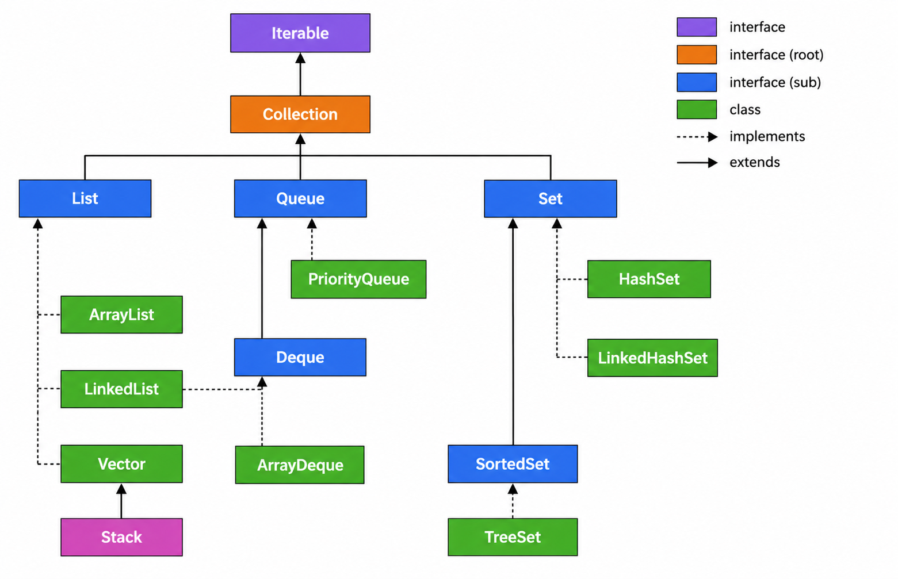

# Collections in Java

## Table of Contents

- [Collections in Java](#collections-in-java)
  - [Table of Contents](#table-of-contents)
  - [What Is a Collection?](#what-is-a-collection)
  - [What Is a Framework?](#what-is-a-framework)
  - [What Is the Collection Framework?](#what-is-the-collection-framework)
  - [Types of Collections in Java](#types-of-collections-in-java)
    - [Main interfaces](#main-interfaces)
    - [Common classes](#common-classes)
  - [Why Use the Collection Framework?](#why-use-the-collection-framework)
- [Collection Framework Hierarchy](#collection-framework-hierarchy)
  - [Important interview point](#important-interview-point)
- [Collection Interface](#collection-interface)
  - [Example](#example)
- [Iterator Interface](#iterator-interface)
  - [Example](#example-1)
  - [Simple meaning](#simple-meaning)
- [Iterable Interface](#iterable-interface)
- [List Interface](#list-interface)
  - [Example](#example-2)
- [ArrayList](#arraylist)
  - [Example](#example-3)
  - [Important constructors](#important-constructors)
  - [Common overloaded methods](#common-overloaded-methods)
  - [Practical advice](#practical-advice)
- [LinkedList](#linkedlist)
  - [Example](#example-4)
  - [Important modern advice](#important-modern-advice)
- [Vector](#vector)
  - [Constructors](#constructors)
  - [Common overloaded methods](#common-overloaded-methods-1)
  - [Modern alternative](#modern-alternative)
- [Stack](#stack)
  - [Modern alternative](#modern-alternative-1)
- [Queue Interface](#queue-interface)
- [PriorityQueue](#priorityqueue)
  - [Important note](#important-note)
- [Deque Interface](#deque-interface)
- [ArrayDeque](#arraydeque)
  - [Modern recommendation](#modern-recommendation)
- [Set Interface](#set-interface)
  - [Example](#example-5)
- [HashSet](#hashset)
  - [Example](#example-6)
  - [Practical use](#practical-use)
- [LinkedHashSet](#linkedhashset)
  - [Use it when](#use-it-when)
- [SortedSet Interface](#sortedset-interface)
- [TreeSet](#treeset)
- [Map Interface](#map-interface)
- [HashMap](#hashmap)
  - [Common methods](#common-methods)
  - [Common overloaded method](#common-overloaded-method)
  - [Practical use](#practical-use-1)
- [Quick Comparison Cheat Sheet](#quick-comparison-cheat-sheet)
- [Modern Java Notes](#modern-java-notes)
  - [Prefer interface types](#prefer-interface-types)
  - [Prefer generics](#prefer-generics)
  - [Prefer the diamond operator](#prefer-the-diamond-operator)
  - [Prefer ArrayDeque for stack behavior](#prefer-arraydeque-for-stack-behavior)
  - [Prefer List.of() for immutable lists](#prefer-listof-for-immutable-lists)
  - [Prefer List.copyOf() for immutable copies](#prefer-listcopyof-for-immutable-copies)
- [Final Summary](#final-summary)

---

## What Is a Collection?

A **collection** is a group of objects stored together so they can be managed easily.

For example:

```java
List<String> names = new ArrayList<>();

names.add("Rahul");
names.add("Priya");
names.add("Amit");
```

Instead of creating separate variables:

```java
String name1 = "Rahul";
String name2 = "Priya";
String name3 = "Amit";
```

a collection stores related objects together.

---

## What Is a Framework?

A framework provides a reusable structure for solving common software problems.

A framework usually provides:

- Interfaces
- Classes
- Reusable components
- Common conventions
- Utility methods

The main benefit is that developers do not need to build everything from scratch.

---

## What Is the Collection Framework?

The Java Collection Framework provides a standardized way to:

- Store objects
- Add objects
- Remove objects
- Search for objects
- Sort objects
- Traverse objects

It contains:

1. **Interfaces**
2. **Implementation classes**
3. **Algorithms and utility methods**

Most commonly used collection classes are available in:

```java
java.util
```

---

## Types of Collections in Java

### Main interfaces

- `List`
- `Set`
- `Queue`
- `Deque`

`Map` is also part of the Java Collections Framework, but it does **not** extend the `Collection` interface.

### Common classes

- `ArrayList`
- `LinkedList`
- `Vector`
- `Stack`
- `PriorityQueue`
- `ArrayDeque`
- `HashSet`
- `LinkedHashSet`
- `TreeSet`
- `HashMap`
- `LinkedHashMap`
- `TreeMap`

---

## Why Use the Collection Framework?

Before the modern framework, Java had different data structures such as arrays, vectors, and hash tables.

The Collection Framework provides a common architecture.

Benefits:

- Standard APIs
- Reusable code
- Better maintainability
- Easier switching between implementations
- Built-in algorithms
- Generic type safety

Example:

```java
List<String> names = new ArrayList<>();
```

Later, the implementation can be changed:

```java
List<String> names = new LinkedList<>();
```

The application can continue programming against the `List` interface.

---

# Collection Framework Hierarchy



Important hierarchy:

```text
Iterable
   |
Collection
   |-------------------------------
   |              |              |
  List           Set           Queue
   |              |              |
ArrayList      HashSet     PriorityQueue
LinkedList     TreeSet     Deque
Vector                       |
Stack                      ArrayDeque

Map is a separate hierarchy:
Map
 |---------------------------
 |             |            |
HashMap   LinkedHashMap   SortedMap
                              |
                         NavigableMap
                              |
                            TreeMap
```

### Important interview point

`Map` is part of the Collections Framework, but:

```text
Map does NOT extend Collection.
```

Why?

A `Collection` works with individual elements:

```java
collection.add(element);
```

A `Map` works with key-value pairs:

```java
map.put(key, value);
```

---

# Collection Interface

The `Collection` interface is the root interface for the main collection hierarchy.

Common methods include:

```java
add()
addAll()
remove()
clear()
contains()
size()
isEmpty()
```

### Example

```java
import java.util.*;

public class CollectionExample {

    public static void main(String[] args) {

        Collection<String> names = new ArrayList<>();

        names.add("Rahul");
        names.add("Priya");
        names.add("Amit");

        for (String name : names) {
            System.out.println(name);
        }
    }
}
```

Output:

```text
Rahul
Priya
Amit
```

---

# Iterator Interface

`Iterator` is used to traverse a collection one element at a time.

Main methods:

```java
hasNext()
next()
remove()
```

### Example

```java
List<String> names = new ArrayList<>();

names.add("Rahul");
names.add("Priya");
names.add("Amit");

Iterator<String> iterator = names.iterator();

while (iterator.hasNext()) {
    System.out.println(iterator.next());
}
```

### Simple meaning

```text
hasNext() → Is another element available?
next()    → Give me the next element.
remove()  → Remove the current element safely.
```

---

# Iterable Interface

`Iterable` is the interface that enables the enhanced `for-each` loop.

It provides:

```java
Iterator<T> iterator();
```

Example:

```java
Iterable<String> names = new ArrayList<>();

names.add("Rahul");
names.add("Priya");

for (String name : names) {
    System.out.println(name);
}
```

The reason the `for-each` loop works is that the object is `Iterable`.

---

# List Interface

A `List`:

- Maintains element order
- Allows duplicate values
- Supports positional access using indexes

Common implementations:

- `ArrayList`
- `LinkedList`
- `Vector`
- `Stack`

### Example

```java
List<String> names = new ArrayList<>();

names.add("Rahul");
names.add("Priya");
names.add("Rahul");

System.out.println(names);
```

Output:

```text
[Rahul, Priya, Rahul]
```

---

# ArrayList

`ArrayList` implements the `List` interface.

It uses a resizable array internally.

Characteristics:

- Maintains insertion order
- Allows duplicates
- Supports fast random access
- Not synchronized

### Example

```java
List<String> names = new ArrayList<>();

names.add("Rahul");
names.add("Priya");
names.add("Amit");

System.out.println(names.get(1));
```

Output:

```text
Priya
```

### Important constructors

```java
new ArrayList<>()
```

Creates an empty list.

```java
new ArrayList<>(10)
```

Creates a list with initial capacity.

```java
new ArrayList<>(existingCollection)
```

Creates a list containing elements from another collection.

### Common overloaded methods

```java
add(E element)
add(int index, E element)

remove(int index)
remove(Object element)

addAll(Collection<? extends E> c)
addAll(int index, Collection<? extends E> c)
```

### Practical advice

For most general-purpose list use cases:

> Start with `ArrayList`.

---

# LinkedList

`LinkedList` is a linked-node-based implementation that supports both `List` and `Deque` behavior.

Characteristics:

- Maintains insertion order
- Allows duplicates
- Not synchronized
- Can efficiently add or remove elements at the ends

### Example

```java
LinkedList<String> names = new LinkedList<>();

names.add("Lucy");
names.add("Peter");
names.add("Lucy");

for (String name : names) {
    System.out.println(name);
}
```

### Important modern advice

Do not automatically choose `LinkedList` just because you expect insertions or deletions.

For many real-world workloads, `ArrayList` performs very well.

Use `LinkedList` when its deque or linked-node behavior specifically matches the problem.

---

# Vector

`Vector` is a legacy synchronized dynamic array.

```java
Vector<String> fruits = new Vector<>();

fruits.add("Apple");
fruits.add("Banana");
fruits.add("Orange");
```

Characteristics:

- Dynamic array
- Thread-safe through synchronization
- Legacy API
- Usually slower than `ArrayList` because of synchronization overhead

### Constructors

```java
new Vector<>()
new Vector<>(initialCapacity)
new Vector<>(initialCapacity, capacityIncrement)
new Vector<>(existingCollection)
```

### Common overloaded methods

```java
add(E element)
add(int index, E element)

remove(int index)
remove(Object element)
```

### Modern alternative

For concurrent code, prefer choosing a collection from `java.util.concurrent` based on the workload instead of automatically using `Vector`.

---

# Stack

`Stack` follows:

```text
LIFO
Last In, First Out
```

Example:

```java
Stack<String> stack = new Stack<>();

stack.push("CPU");
stack.push("Monitor");
stack.push("Mouse");

System.out.println(stack.pop());
```

Output:

```text
Mouse
```

Common methods:

```java
push()
pop()
peek()
empty()
search()
```

### Modern alternative

Prefer:

```java
Deque<String> stack = new ArrayDeque<>();
```

Then:

```java
stack.push("CPU");
stack.push("Monitor");

System.out.println(stack.pop());
```

`ArrayDeque` is generally preferred for modern stack usage.

---

# Queue Interface

A `Queue` usually processes elements in:

```text
FIFO
First In, First Out
```

Example:

```java
Queue<String> queue = new LinkedList<>();

queue.add("Rahul");
queue.add("Priya");
queue.add("Amit");

System.out.println(queue.poll());
```

Output:

```text
Rahul
```

Common methods:

| Operation | Throws Exception | Special Value |
| --------- | ---------------- | ------------- |
| Add       | `add()`          | `offer()`     |
| Remove    | `remove()`       | `poll()`      |
| Read head | `element()`      | `peek()`      |

---

# PriorityQueue

`PriorityQueue` processes elements according to priority rather than simple insertion order.

For natural ordering:

```java
PriorityQueue<Integer> queue = new PriorityQueue<>();

queue.add(30);
queue.add(10);
queue.add(20);

System.out.println(queue.poll());
```

Output:

```text
10
```

### Important note

Iteration order is not guaranteed to be fully sorted.

The queue guarantees that the head follows its priority rules.

---

# Deque Interface

`Deque` means:

```text
Double-Ended Queue
```

Elements can be added or removed from both ends.

```java
Deque<String> deque = new ArrayDeque<>();

deque.addFirst("Rahul");
deque.addLast("Priya");

System.out.println(deque);
```

Common methods:

```java
addFirst()
addLast()

removeFirst()
removeLast()

peekFirst()
peekLast()
```

A `Deque` can be used as:

- Queue
- Stack
- Double-ended queue

---

# ArrayDeque

`ArrayDeque` implements `Deque`.

```java
Deque<String> deque = new ArrayDeque<>();

deque.add("Lucy");
deque.add("Andrew");
deque.add("Henry");

for (String value : deque) {
    System.out.println(value);
}
```

### Modern recommendation

For stack or queue use cases, `ArrayDeque` is often a strong default choice.

It is commonly preferred over:

- `Stack`
- Using `LinkedList` as a stack

---

# Set Interface

A `Set` stores unique elements.

Characteristics:

- Duplicate elements are not allowed
- Ordering depends on implementation

Common implementations:

- `HashSet`
- `LinkedHashSet`
- `TreeSet`

### Example

```java
Set<String> names = new HashSet<>();

names.add("Rahul");
names.add("Priya");
names.add("Rahul");

System.out.println(names);
```

The second `"Rahul"` is not stored as a separate duplicate.

---

# HashSet

`HashSet` uses hashing internally.

Characteristics:

- Unique elements
- No guaranteed insertion order
- Fast membership operations on average
- Allows one `null`

### Example

```java
Set<String> set = new HashSet<>();

set.add("Andrew");
set.add("Mark");
set.add("Peter");

System.out.println(set);
```

### Practical use

Use `HashSet` when:

> You need uniqueness and do not care about order.

---

# LinkedHashSet

`LinkedHashSet`:

- Stores unique elements
- Maintains insertion order

Example:

```java
Set<String> set = new LinkedHashSet<>();

set.add("Peter");
set.add("Jack");
set.add("Peter");
set.add("Johnson");

System.out.println(set);
```

Output:

```text
[Peter, Jack, Johnson]
```

### Use it when

> You need uniqueness and predictable insertion order.

---

# SortedSet Interface

`SortedSet` stores elements in sorted order.

Example:

```java
SortedSet<String> set = new TreeSet<>();

set.add("Rahul");
set.add("Priya");
set.add("Amit");

System.out.println(set);
```

Output:

```text
[Amit, Priya, Rahul]
```

---

# TreeSet

`TreeSet` stores unique elements in sorted order.

```java
Set<String> set = new TreeSet<>();

set.add("Thomas");
set.add("Davis");
set.add("Donald");

System.out.println(set);
```

Output:

```text
[Davis, Donald, Thomas]
```

Typical performance:

```text
O(log n)
```

for common insertion, removal, and lookup operations.

---

# Map Interface

For deper insights check [this](https://github.com/Vivid-Vortex/Misc/blob/130df58e2489e2845a22d3d8d125bb4cf4c09602/Concepts/Backend/Interview%20Questions/Collections%20In%20Java/Java_Map_Interface.md)

A `Map` stores:

```text
Key → Value
```

Rules:

- Keys must be unique
- Values may be duplicated

Example:

```java
Map<Integer, String> map = new HashMap<>();

map.put(1, "Rahul");
map.put(2, "Priya");
map.put(3, "Amit");

System.out.println(map);
```

Output:

```text
{1=Rahul, 2=Priya, 3=Amit}
```

Common implementations:

- `HashMap`
- `LinkedHashMap`
- `TreeMap`

Important:

> `Map` is part of the Collections Framework but is a separate hierarchy from `Collection`.

---

# HashMap

`HashMap` stores key-value pairs using hashing.

Example:

```java
Map<String, Integer> scores = new HashMap<>();

scores.put("Alice", 10);
scores.put("Bob", 20);
scores.put("Charlie", 30);

System.out.println(scores.get("Alice"));
```

Output:

```text
10
```

### Common methods

```java
put(key, value)
get(key)
remove(key)
containsKey(key)
containsValue(value)
keySet()
values()
entrySet()
```

### Common overloaded method

```java
remove(Object key)
remove(Object key, Object value)

replace(K key, V value)
replace(K key, V oldValue, V newValue)
```

### Practical use

Use `HashMap` when:

> Fast key-based lookup is needed and sorted or insertion order is not required.

---

# Quick Comparison Cheat Sheet

| Collection      | Order                                          | Duplicates  | Typical Use                   |
| --------------- | ---------------------------------------------- | ----------- | ----------------------------- |
| `ArrayList`     | Insertion                                      | Yes         | General-purpose list          |
| `LinkedList`    | Insertion                                      | Yes         | Deque/list-specific workloads |
| `HashSet`       | No guaranteed order                            | No          | Fast uniqueness               |
| `LinkedHashSet` | Insertion                                      | No          | Ordered uniqueness            |
| `TreeSet`       | Sorted                                         | No          | Sorted unique values          |
| `PriorityQueue` | Priority                                       | Yes         | Priority processing           |
| `ArrayDeque`    | Deque order                                    | Yes         | Queue or stack                |
| `HashMap`       | No guaranteed order                            | Unique keys | Fast key lookup               |
| `LinkedHashMap` | Insertion/access order depending configuration | Unique keys | Ordered maps                  |
| `TreeMap`       | Sorted keys                                    | Unique keys | Sorted key access             |

---

# Modern Java Notes

## Prefer interface types

Prefer:

```java
List<String> names = new ArrayList<>();
```

instead of:

```java
ArrayList<String> names = new ArrayList<>();
```

Why?

Because your code depends on the abstraction:

```java
List
```

rather than a specific implementation.

---

## Prefer generics

Prefer:

```java
List<String> names = new ArrayList<>();
```

instead of:

```java
List names = new ArrayList();
```

Generics provide compile-time type safety.

---

## Prefer the diamond operator

Modern style:

```java
List<String> names = new ArrayList<>();
```

Older style:

```java
List<String> names = new ArrayList<String>();
```

---

## Prefer ArrayDeque for stack behavior

Modern:

```java
Deque<Integer> stack = new ArrayDeque<>();
```

Legacy:

```java
Stack<Integer> stack = new Stack<>();
```

---

## Prefer List.of() for immutable lists

```java
List<String> names = List.of(
        "Rahul",
        "Priya",
        "Amit"
);
```

This list cannot be modified.

---

## Prefer List.copyOf() for immutable copies

```java
List<String> copy = List.copyOf(names);
```

This creates an unmodifiable copy.

---

# Final Summary

The most important concepts to remember are:

```text
List  → Ordered, duplicates allowed
Set   → Unique elements
Queue → Processing order
Deque → Both ends
Map   → Key-value pairs
```

For implementation choices:

```text
ArrayList     → Default general-purpose list
HashSet       → Fast uniqueness
LinkedHashSet → Unique + insertion order
TreeSet       → Unique + sorted
ArrayDeque    → Modern queue/stack
HashMap       → Fast key-value lookup
TreeMap       → Sorted keys
```

> The best collection is not the one with the lowest theoretical complexity. It is the one whose behavior matches the actual workload.
