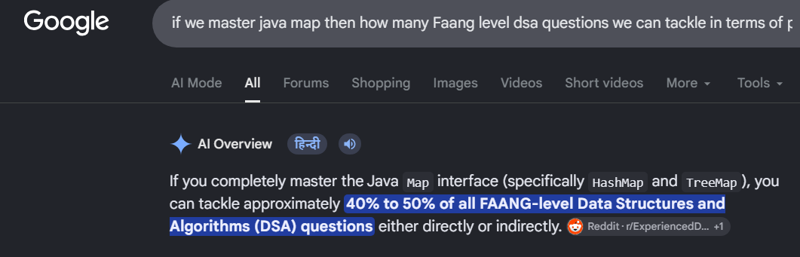
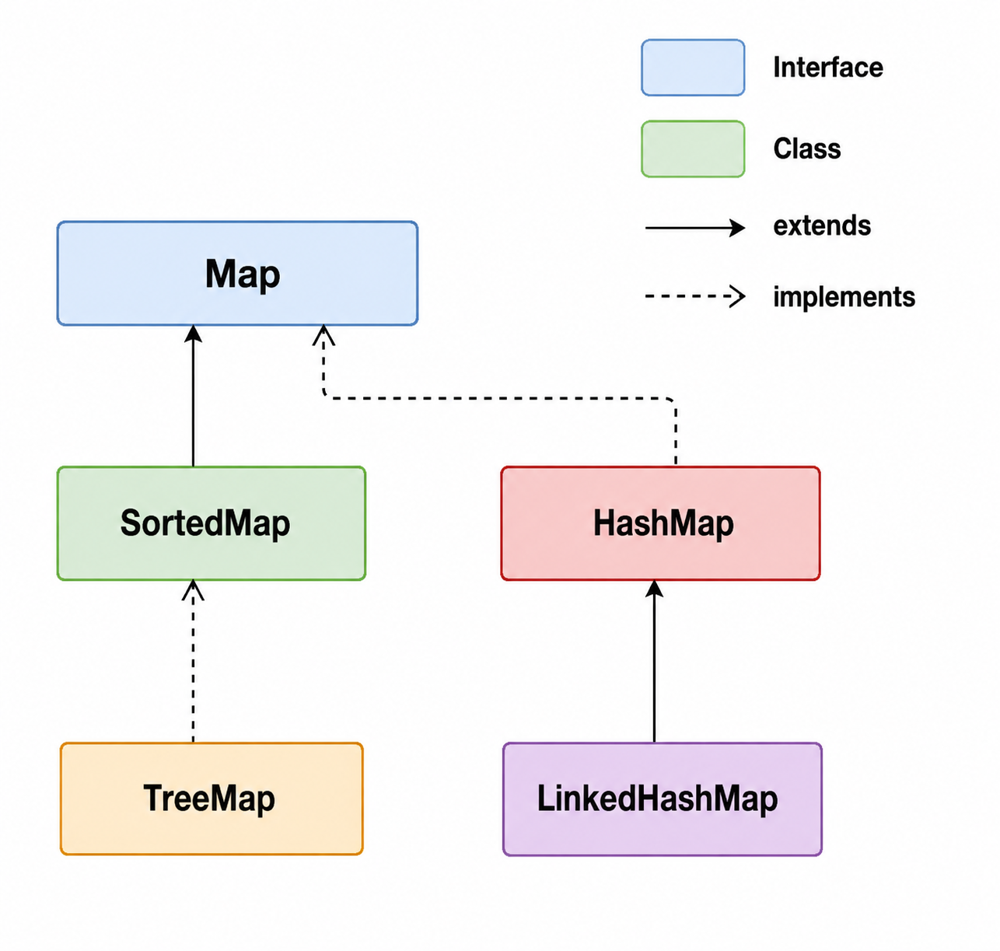

# Java Map Interface (Master and memorize each and every methods of map and solve as many DSA questions on it as possible, as with Map interface (specifically HashMap and TreeMap), you can tackle approximately 40% to 50% of all FAANG-level Data Structures and Algorithms (DSA) questions either directly or indirectly.)



## Table of Contents

- [What Is the Map Interface?](#what-is-the-map-interface)
- [Why Use a Map?](#why-use-a-map)
- [Key Features of Map](#key-features-of-map)
- [Map Hierarchy](#map-hierarchy)
- [Common Map Implementations](#common-map-implementations)
- [Common Map Methods](#common-map-methods)
- [Map.Entry Interface](#mapentry-interface)
- [Creating and Traversing a Map](#creating-and-traversing-a-map)
- [Generic vs Non-Generic Map](#generic-vs-non-generic-map)
- [Sorting a Map by Key](#sorting-a-map-by-key)
- [HashMap](#hashmap)
- [LinkedHashMap](#linkedhashmap)
- [TreeMap](#treemap)
- [Modern Map Methods](#modern-map-methods)
- [Choosing the Right Map](#choosing-the-right-map)
- [Quick Interview Cheat Sheet](#quick-interview-cheat-sheet)

---

## What Is the Map Interface?

The Java `Map` interface stores data as:

```text
Key → Value
```

Each key identifies its associated value.

```java
Map<Integer, String> students = new HashMap<>();

students.put(101, "Rahul");
students.put(102, "Priya");
```

Conceptually:

```text
101 → Rahul
102 → Priya
```

A `Map` is useful when data must be searched, updated, or removed using a key.

---

## Why Use a Map?

A `Map` is useful for:

### Fast lookup

```java
students.get(101);
```

### Unique keys

A key cannot exist twice as separate entries.

```java
map.put(101, "Rahul");
map.put(101, "Amit");
```

The value for key `101` becomes `"Amit"`.

### Associative data

A map represents relationships such as:

```text
Employee ID → Employee
Username    → User
Product ID  → Product
Country     → Capital
```

### Caching and memoization

A `Map` can store previously calculated results.

---

## Key Features of Map

### 1. Key-value structure

```java
map.put("name", "Rahul");
```

### 2. Keys are unique

Duplicate keys replace the existing value.

### 3. Values may be duplicated

```java
map.put(1, "Java");
map.put(2, "Java");
```

This is valid.

### 4. Null support depends on implementation

For example, `HashMap` supports:

- One `null` key
- Multiple `null` values

Other implementations have different rules.

### 5. Map is not a subtype of Collection

This is important:

```text
Map is part of the Java Collections Framework,
but Map does NOT extend Collection.
```

### 6. Maps are viewed through collections

Common views:

```java
map.keySet()
map.values()
map.entrySet()
```

---

## Map Hierarchy



A simplified hierarchy:

```text
Map
├── HashMap
├── LinkedHashMap
├── SortedMap
│   └── NavigableMap
│       └── TreeMap
└── ConcurrentMap
```

---

## Common Map Implementations

| Implementation  | Ordering                      | Typical Performance | Best Use                         |
| --------------- | ----------------------------- | ------------------: | -------------------------------- |
| `HashMap`       | No guaranteed iteration order |      Average `O(1)` | General-purpose lookup           |
| `LinkedHashMap` | Predictable order             |      Average `O(1)` | Preserve iteration order         |
| `TreeMap`       | Sorted by key                 |          `O(log n)` | Sorted keys and range operations |

---

# Common Map Methods

## `put()`

Adds or updates an entry.

```java
map.put(101, "Rahul");
```

If the key already exists, the previous value is replaced.

---

## `putAll()`

Copies entries from another map.

```java
map1.putAll(map2);
```

---

## `putIfAbsent()`

Adds a value only when the key does not already have a mapping.

```java
map.putIfAbsent(101, "Rahul");
```

---

## `get()`

Returns the value for a key.

```java
String name = map.get(101);
```

---

## `getOrDefault()`

Returns a default value when the key is absent.

```java
String name = map.getOrDefault(999, "Unknown");
```

---

## `remove()`

### Remove by key

```java
map.remove(101);
```

### Remove only if key and value match

```java
map.remove(101, "Rahul");
```

---

## `containsKey()`

```java
boolean exists = map.containsKey(101);
```

---

## `containsValue()`

```java
boolean exists = map.containsValue("Rahul");
```

---

## `keySet()`

Returns a `Set` view of keys.

```java
Set<Integer> keys = map.keySet();
```

---

## `values()`

Returns a collection view of values.

```java
Collection<String> values = map.values();
```

---

## `entrySet()`

Returns a set of key-value entries.

```java
Set<Map.Entry<Integer, String>> entries =
        map.entrySet();
```

---

## `size()` and `isEmpty()`

```java
int size = map.size();

boolean empty = map.isEmpty();
```

---

## `clear()`

Removes all mappings.

```java
map.clear();
```

---

# Map.Entry Interface

`Map.Entry<K, V>` represents one key-value pair.

Example:

```java
for (Map.Entry<Integer, String> entry
        : map.entrySet()) {

    System.out.println(
            entry.getKey() + " " + entry.getValue()
    );
}
```

Important methods:

```java
getKey()
getValue()
setValue()
```

### Modern comparator helpers

```java
Map.Entry.comparingByKey()
Map.Entry.comparingByValue()
```

With a custom comparator:

```java
Map.Entry.comparingByKey(Comparator.reverseOrder())
```

---

# Creating and Traversing a Map

## Modern generic style

```java
Map<Integer, String> map = new HashMap<>();

map.put(100, "Amit");
map.put(101, "Vijay");
map.put(102, "Rahul");

for (Map.Entry<Integer, String> entry
        : map.entrySet()) {

    System.out.println(
            entry.getKey() + " " + entry.getValue()
    );
}
```

This is the preferred style because generics provide compile-time type safety.

---

# Generic vs Non-Generic Map

## Old non-generic style

```java
Map map = new HashMap();

map.put(1, "Rahul");
map.put(2, "Priya");
```

Problems:

- No compile-time type safety
- Explicit casting may be required

---

## Modern generic style

```java
Map<Integer, String> map = new HashMap<>();

map.put(1, "Rahul");
map.put(2, "Priya");
```

This is safer and clearer.

---

# Sorting a Map by Key

## Ascending order

```java
Map<Integer, String> map = new HashMap<>();

map.put(102, "Rahul");
map.put(100, "Amit");
map.put(101, "Vijay");

map.entrySet()
        .stream()
        .sorted(Map.Entry.comparingByKey())
        .forEach(System.out::println);
```

Result:

```text
100=Amit
101=Vijay
102=Rahul
```

---

## Descending order

```java
map.entrySet()
        .stream()
        .sorted(
                Map.Entry.comparingByKey(
                        Comparator.reverseOrder()
                )
        )
        .forEach(System.out::println);
```

---

# HashMap

`HashMap` is the most common general-purpose implementation of `Map`.

Characteristics:

- Unique keys
- No guaranteed iteration order
- Average `O(1)` lookup, insertion, and removal
- Allows one `null` key
- Allows multiple `null` values
- Not thread-safe

### Simple example

```java
Map<Integer, String> students = new HashMap<>();

students.put(1001, "John");
students.put(1002, "Emily");
students.put(1003, "Michael");

System.out.println(students.get(1002));
```

### Common constructors

```java
new HashMap<>()
new HashMap<>(initialCapacity)
new HashMap<>(initialCapacity, loadFactor)
new HashMap<>(existingMap)
```

### When to use

Use `HashMap` when:

> You need fast general-purpose key-based access and ordering is not important.

---

# LinkedHashMap

`LinkedHashMap` combines hash-based lookup with predictable iteration order.

By default, it preserves insertion order.

```java
Map<Integer, String> students =
        new LinkedHashMap<>();

students.put(1001, "John");
students.put(1002, "Emily");
students.put(1003, "Michael");

students.forEach(
        (id, name) -> System.out.println(id + " " + name)
);
```

Output follows insertion order.

### Access-order mode

`LinkedHashMap` can also maintain access order using an appropriate constructor configuration.

This can be useful for cache-like scenarios.

### When to use

Use it when:

> You want hash-map-like lookup performance and predictable iteration order.

---

# TreeMap

`TreeMap` stores keys in sorted order.

It is backed by a balanced tree structure.

Characteristics:

- Keys are sorted
- Natural ordering or custom `Comparator`
- Common operations are `O(log n)`
- Supports navigation and range operations through `NavigableMap`

### Example

```java
Map<Integer, String> students = new TreeMap<>();

students.put(1003, "Michael");
students.put(1001, "John");
students.put(1002, "Emily");

students.forEach(
        (id, name) -> System.out.println(id + " " + name)
);
```

Output:

```text
1001 John
1002 Emily
1003 Michael
```

### When to use

Use `TreeMap` when:

> Keys must remain sorted or range queries are required.

---

# Modern Map Methods

## `computeIfAbsent()`

Useful for creating a value only when needed.

```java
Map<String, List<String>> groups = new HashMap<>();

groups.computeIfAbsent(
        "Java",
        key -> new ArrayList<>()
).add("Rahul");
```

This avoids manual null checks.

---

## `computeIfPresent()`

Updates an existing mapping.

```java
map.computeIfPresent(
        "count",
        (key, value) -> value + 1
);
```

---

## `compute()`

Computes a new value using the key and current value.

```java
map.compute(
        "count",
        (key, value) -> value == null ? 1 : value + 1
);
```

---

## `merge()`

Very useful for counters.

```java
map.merge(
        "Java",
        1,
        Integer::sum
);
```

Simple meaning:

```text
If key does not exist → insert 1
If key exists          → add existing value + 1
```

This is a clean modern alternative to:

```java
if (map.containsKey("Java")) {
    map.put("Java", map.get("Java") + 1);
} else {
    map.put("Java", 1);
}
```

---

## `forEach()`

```java
map.forEach(
        (key, value) ->
                System.out.println(key + " = " + value)
);
```

---

## `replace()`

```java
map.replace("name", "Rahul");
```

Conditional replacement:

```java
map.replace(
        "name",
        "OldName",
        "Rahul"
);
```

---

## `replaceAll()`

```java
map.replaceAll(
        (key, value) -> value.toUpperCase()
);
```

---

# Choosing the Right Map

## Use `HashMap`

When:

- Fast lookup matters
- Order does not matter

```text
Default general-purpose Map
```

---

## Use `LinkedHashMap`

When:

- Predictable iteration order matters
- You need insertion-order traversal

---

## Use `TreeMap`

When:

- Keys must remain sorted
- Range or navigation operations are required

---

## Use `ConcurrentHashMap`

When:

- Multiple threads access and modify the map concurrently
- A concurrent map is required

---

# Quick Interview Cheat Sheet

| Question                    | Short Answer                   |
| --------------------------- | ------------------------------ |
| What does a Map store?      | Key-value pairs                |
| Can keys be duplicated?     | No                             |
| Can values be duplicated?   | Yes                            |
| Does Map extend Collection? | No                             |
| Fast general-purpose map    | `HashMap`                      |
| Preserves insertion order   | `LinkedHashMap`                |
| Sorts keys                  | `TreeMap`                      |
| Get all keys                | `keySet()`                     |
| Get all values              | `values()`                     |
| Get key-value entries       | `entrySet()`                   |
| Modern missing-key default  | `getOrDefault()`               |
| Add only when absent        | `putIfAbsent()`                |
| Initialize lazily           | `computeIfAbsent()`            |
| Combine values              | `merge()`                      |
| Sort entries by key         | `Map.Entry.comparingByKey()`   |
| Sort entries by value       | `Map.Entry.comparingByValue()` |

---

# Final Practical Advice

For most applications:

```text
Need fast lookup only?
→ HashMap
```

```text
Need fast lookup + predictable order?
→ LinkedHashMap
```

```text
Need sorted keys?
→ TreeMap
```

The most important thing to remember is:

> Choose the map based on lookup behavior, ordering requirements, concurrency needs, and actual workload.
