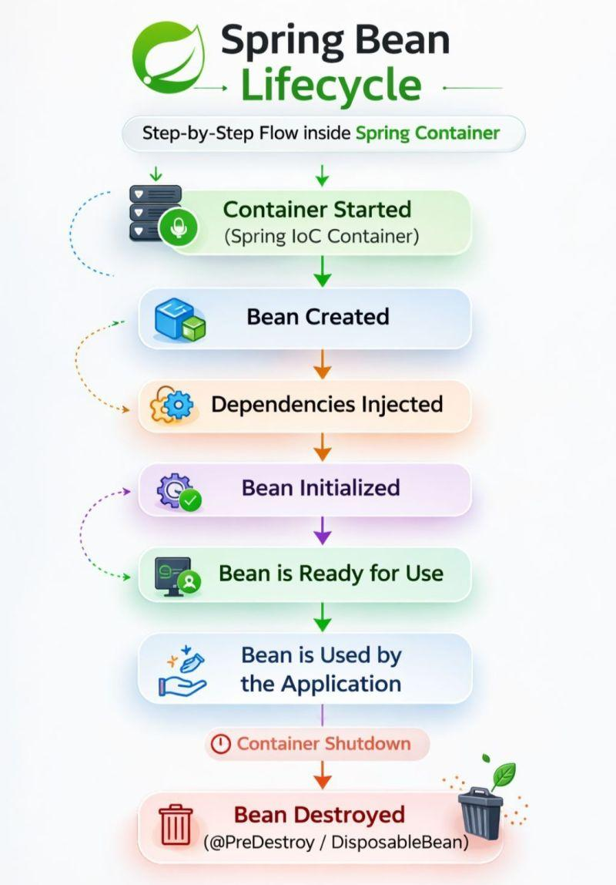
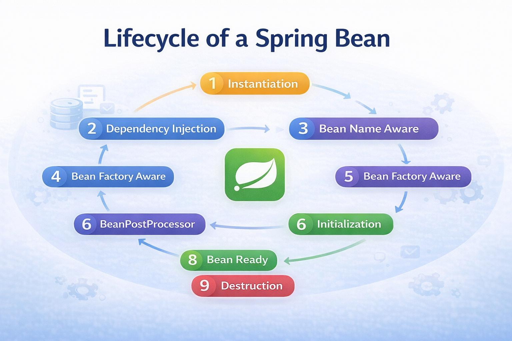
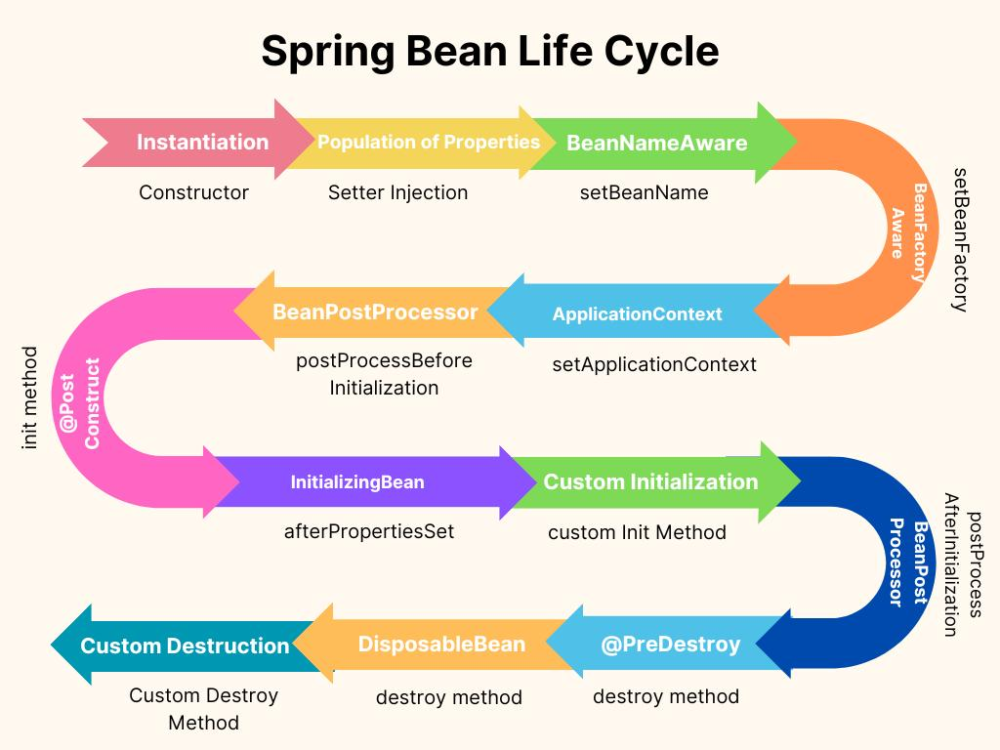
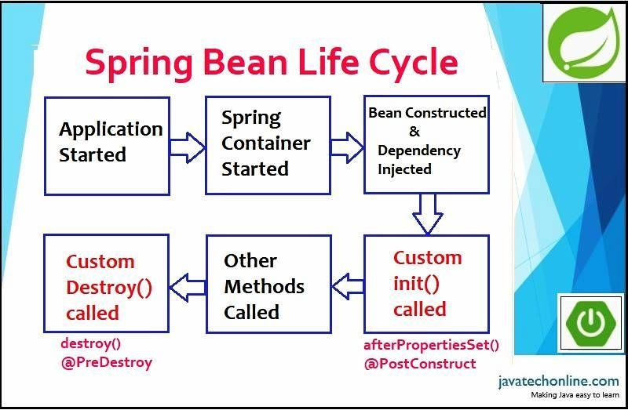

You're right on spot. Let's understand the **Spring Bean Life Cycle** in the simplest possible way.

# Q: What is the Spring Bean Life Cycle?

Think of a Spring Bean like an employee joining a company:

**Create → Give dependencies → Initialize → Use → Destroy**

Spring manages all of these steps for you.










The simplified lifecycle is:

```text
Spring Container starts
        ↓
1. Create Bean
        ↓
2. Inject Dependencies
        ↓
3. Initialization
        ↓
4. Bean is Ready
        ↓
5. Bean is Used
        ↓
6. Container shuts down
        ↓
7. Destroy Bean
```

---

# Q: Let's understand each step

Suppose we have:

```java
@Component
public class PaymentService {

    private PaymentRepository repository;

    @Autowired
    public void setRepository(PaymentRepository repository) {
        this.repository = repository;
    }

    @PostConstruct
    public void init() {
        System.out.println("Bean initialized");
    }

    @PreDestroy
    public void destroy() {
        System.out.println("Bean destroyed");
    }
}
```

Now let's see what Spring does.

---

## 1. Spring creates the Bean

Spring sees:

```java
@Component
public class PaymentService
```

and creates an object:

```java
PaymentService paymentService = new PaymentService();
```

Conceptually:

```text
Spring Container
      ↓
new PaymentService()
      ↓
PaymentService object created
```

This is the **instantiation** phase.

---

# Q: Does Spring call the constructor?

**Yes.**

For example:

```java
@Component
public class PaymentService {

    public PaymentService() {
        System.out.println("Constructor called");
    }
}
```

Output:

```text
Constructor called
```

So the first important point is:

> **Constructor → object gets created**

---

# 2. Spring injects dependencies

Suppose:

```java
@Component
public class PaymentService {

    @Autowired
    private PaymentRepository repository;
}
```

Spring first creates:

```text
PaymentService object
```

Then it injects:

```text
PaymentRepository
       ↓
PaymentService.repository
```

Conceptually:

```text
1. new PaymentService()

2. repository is injected

3. PaymentService is now ready for initialization
```

This is why you shouldn't expect an `@Autowired` field to be available inside the constructor.

For example:

```java
public PaymentService() {
    System.out.println(repository); // null
}
```

At this point, dependency injection hasn't happened yet.

---

# 3. Spring performs initialization

This is where annotations like:

```java
@PostConstruct
```

come into play.

Example:

```java
@PostConstruct
public void init() {
    System.out.println("Initialization");
}
```

Spring calls:

```text
@PostConstruct method
```

after dependencies have been injected.

So:

```text
Constructor
     ↓
Dependency Injection
     ↓
@PostConstruct
```

This is a very important interview sequence.

---

# 4. Bean is ready

After initialization:

```text
PaymentService
      ↓
READY
```

Now your application can use it:

```java
paymentService.processPayment();
```

---

# 5. Bean remains alive

The bean normally stays inside the Spring container.

For example:

```text
Spring Container
 ├── PaymentService
 ├── PaymentRepository
 ├── OrderService
 └── UserService
```

Your application uses these beans whenever required.

---

# 6. Application shuts down

Eventually Spring's application context shuts down.

For example:

```text
Application running
       ↓
Application shutdown
```

Spring now needs to clean up beans.

---

# 7. Spring destroys the Bean

If you have:

```java
@PreDestroy
public void destroy() {
    System.out.println("Bean destroyed");
}
```

Spring calls it before destroying the bean.

So the final sequence becomes:

```text
Constructor
    ↓
Dependency Injection
    ↓
@PostConstruct
    ↓
Bean Ready
    ↓
Bean Used
    ↓
@PreDestroy
    ↓
Bean Destroyed
```

---

# Q: What is the complete Spring Bean Life Cycle?

For an interview, remember this:

```text
1. Instantiate Bean
       ↓
2. Populate / Inject Dependencies
       ↓
3. BeanPostProcessor - before initialization
       ↓
4. @PostConstruct
       ↓
5. InitializingBean.afterPropertiesSet()
       ↓
6. Custom init method
       ↓
7. BeanPostProcessor - after initialization
       ↓
8. Bean is Ready
       ↓
9. Application shuts down
       ↓
10. @PreDestroy
       ↓
11. DisposableBean.destroy()
       ↓
12. Custom destroy method
```

You **don't need to memorize every step initially**. The most important mental model is:

```text
CREATE
  ↓
INJECT
  ↓
INITIALIZE
  ↓
USE
  ↓
DESTROY
```

---

# Q: What are `@PostConstruct` and `@PreDestroy`?

### `@PostConstruct`

Means:

> "Run this method after Spring has created the bean and injected its dependencies."

```java
@PostConstruct
public void init() {
    System.out.println("Bean is ready");
}
```

Common uses:

* Loading initial data
* Validating configuration
* Opening resources
* Performing initialization

---

### `@PreDestroy`

Means:

> "Run this method just before Spring destroys the bean."

```java
@PreDestroy
public void cleanup() {
    System.out.println("Cleaning up");
}
```

Common uses:

* Closing resources
* Closing connections
* Cleanup work

---

# Q: Where does `BeanPostProcessor` fit?

This is a slightly more advanced but **very important interview concept**.

Spring allows you to intercept beans before and after initialization.

```text
Bean created
     ↓
Dependencies injected
     ↓
BeanPostProcessor
     ↓
@PostConstruct
     ↓
InitializingBean
     ↓
Custom init
     ↓
BeanPostProcessor
     ↓
Bean ready
```

For example:

```java
@Component
public class MyProcessor implements BeanPostProcessor {

    @Override
    public Object postProcessBeforeInitialization(
            Object bean, String beanName) {

        System.out.println("Before initialization");
        return bean;
    }

    @Override
    public Object postProcessAfterInitialization(
            Object bean, String beanName) {

        System.out.println("After initialization");
        return bean;
    }
}
```

Spring uses `BeanPostProcessor` heavily internally.

Things such as **Spring AOP, proxies, `@Autowired` processing, etc.** involve Spring's post-processing infrastructure.

---

# Q: What are the different initialization methods?

Spring gives you several ways.

### 1. `@PostConstruct` — modern/common approach

```java
@PostConstruct
public void init() {
}
```

### 2. `InitializingBean`

```java
public class PaymentService implements InitializingBean {

    @Override
    public void afterPropertiesSet() {
        System.out.println("Init");
    }
}
```

### 3. Custom init method

For example:

```java
@Bean(initMethod = "init")
public PaymentService paymentService() {
    return new PaymentService();
}
```

with:

```java
public void init() {
}
```

For most application code, **`@PostConstruct` is the simplest choice**.

---

# Q: What are the destruction methods?

Similarly:

### 1. `@PreDestroy`

```java
@PreDestroy
public void cleanup() {
}
```

### 2. `DisposableBean`

```java
public class PaymentService implements DisposableBean {

    @Override
    public void destroy() {
    }
}
```

### 3. Custom destroy method

```java
@Bean(destroyMethod = "cleanup")
public PaymentService paymentService() {
    return new PaymentService();
}
```

Again, `@PreDestroy` is generally the easiest to understand and use.

---

# ⭐ Interview Question

### Q: What is the order between constructor, `@Autowired`, and `@PostConstruct`?

Answer:

```text
Constructor
    ↓
Dependency Injection
    ↓
@PostConstruct
```

For example:

```java
@Component
public class TestBean {

    @Autowired
    private UserService userService;

    public TestBean() {
        System.out.println("1. Constructor");
    }

    @PostConstruct
    public void init() {
        System.out.println("3. PostConstruct");
    }
}
```

Conceptually:

```text
1. Constructor
       ↓
2. userService injected
       ↓
3. @PostConstruct
```

Therefore:

```java
public TestBean() {
    userService.doSomething(); // ❌ Don't do this
}
```

because field injection hasn't happened yet.

---

# ⭐ One important improvement: Constructor Injection

Instead of:

```java
@Autowired
private UserService userService;
```

prefer:

```java
@Component
public class TestBean {

    private final UserService userService;

    public TestBean(UserService userService) {
        this.userService = userService;
    }
}
```

Now the dependency is available **during construction**.

So the lifecycle becomes conceptually:

```text
Spring finds UserService
        ↓
Spring calls TestBean(UserService)
        ↓
TestBean created with dependency
        ↓
@PostConstruct
        ↓
Bean ready
```

This is generally preferred over field injection because dependencies are explicit and the field can be `final`.

---

# 🧠 Easy way to remember

Imagine a person joining a company:

```text
Constructor
   ↓
Person is born/created

Dependency Injection
   ↓
Give the person required tools

@PostConstruct
   ↓
Training / setup

Bean Ready
   ↓
Person starts working

@PreDestroy
   ↓
Exit/cleanup

Bean Destroyed
```

### The one-line interview answer:

> **Spring Bean lifecycle is the sequence through which Spring creates a bean, injects its dependencies, initializes it, makes it available for use, and finally performs cleanup before destroying it.**

If you're preparing for a **TCS backend interview**, the next level I'd focus on is **Bean scope + Bean lifecycle together**, especially **singleton vs prototype**, because interviewers often connect these two topics.
