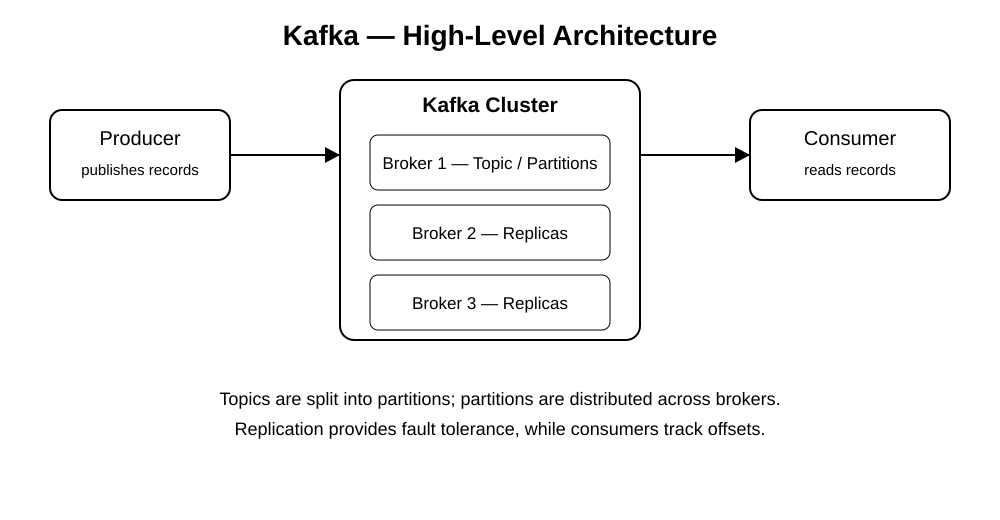
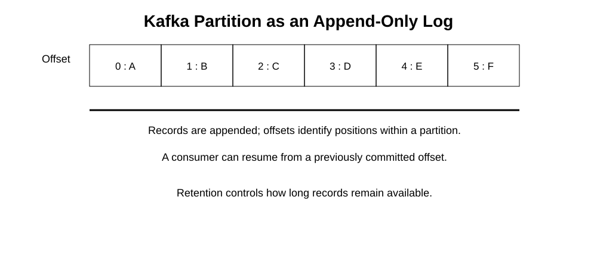
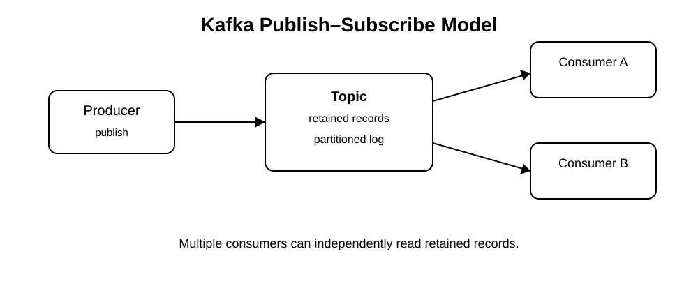

# Apache Kafka Tutorial — Personal Study Pack

>   
>
> This study pack is an original, paraphrased set of learning notes based on the referenced article. It is **not a verbatim copy** of the article. The diagrams in `images/` are original recreations for study use.

## 1. What is Apache Kafka?

Apache Kafka is a distributed event-streaming platform used to move and process streams of records between systems.

A simple mental model:

```text
Producer  ->  Kafka Topic  ->  Consumer
```

Kafka is useful when applications need high-throughput, durable, scalable communication.

Typical characteristics:

- Distributed
- Horizontally scalable
- Durable
- Fault tolerant through replication
- High throughput
- Suitable for asynchronous communication
- Supports independent producers and consumers

## 2. Messaging Models

### Point-to-point

A message is placed into a queue and is normally processed by one consumer.

```text
Producer -> Queue -> Consumer
```

### Publish-subscribe

A producer publishes records to a topic. Multiple consumers can independently consume the retained records.

```text
Producer -> Topic -> Consumer A
                 -> Consumer B
```

Kafka is primarily associated with the publish-subscribe/event-streaming model.

## 3. Why Kafka?

Kafka is commonly selected when a system needs:

1. High write/read throughput
2. Horizontal scaling
3. Durable event storage
4. Fault tolerance
5. Loose coupling between services
6. Replayable events
7. Multiple independent consumers

## 4. Core Kafka Components

### Topic

A topic is a named stream/category of records.

Examples:

```text
orders
payments
notifications
inventory-events
```

Topics are divided into partitions.

### Partition

A partition is an ordered, append-only sequence of records.

Each record receives an offset:

```text
0 -> A
1 -> B
2 -> C
3 -> D
```

Ordering is guaranteed within a partition, not across all partitions of a topic.

### Producer

A producer publishes records to Kafka topics.

A producer can select a partition explicitly or allow Kafka's partitioning logic to select one.

### Consumer

A consumer reads records from Kafka.

Consumers normally keep track of their progress using offsets.

### Broker

A broker is a Kafka server that stores partitions and serves producer/consumer requests.

A Kafka cluster contains multiple brokers.

### Consumer Group

A consumer group lets multiple consumer instances cooperate.

Within one consumer group, a partition is assigned to only one consumer instance at a time.

```text
Topic
  P0 -> Consumer 1
  P1 -> Consumer 2
  P2 -> Consumer 3
```

This enables parallel consumption.

## 5. Kafka Cluster

A cluster contains multiple brokers.

Example:

```text
              Kafka Cluster
        +-----------------------+
        | Broker 1              |
        | Broker 2              |
        | Broker 3              |
        +-----------------------+
```

Partitions can be distributed across brokers.

Replication creates additional copies of partitions so that another broker can take over when a broker fails.

## 6. Replication and Leaders

For a replicated partition, one replica acts as the leader and other replicas maintain copies.

Conceptually:

```text
Partition P0

Broker 1 -> Leader
Broker 2 -> Replica
Broker 3 -> Replica
```

The leader handles normal client traffic for that partition, while replicas provide redundancy.

## 7. Kafka Log Anatomy

A Kafka partition behaves like an append-only log:

```text
Offset:   0     1     2     3     4
          |     |     |     |     |
Record:   A     B     C     D     E
```

A consumer can remember an offset and continue from that point.

The record does not disappear merely because one consumer has read it. Retention policies determine when Kafka removes old records.

See:

`images/kafka-partition-log.svg`

## 8. Retention

Kafka can retain records for a configured period or according to configured storage limits.

This creates an important distinction from traditional queues:

```text
Consumer reads record
        |
        v
Record can still remain in Kafka
        |
        v
Another consumer can read it independently
```

If a consumer is temporarily unavailable, it can normally continue from its previously stored position as long as the required records are still retained.

## 9. Kafka Workflow

A simplified workflow is:

```text
1. Producer creates a record
2. Producer sends it to Kafka
3. Kafka places it in a topic partition
4. Broker stores the record
5. Consumer polls Kafka
6. Consumer processes the record
7. Consumer commits its progress/offset
```

## 10. Partitioning and Scalability

Suppose a topic has three partitions:

```text
orders
  |
  +-- P0
  +-- P1
  +-- P2
```

Different partitions can be processed in parallel.

Therefore, partitioning is one of the key mechanisms that enables Kafka to scale horizontally.

A useful interview statement:

> More partitions can provide more consumer parallelism, but partition count should be designed carefully because partitions also increase operational and resource overhead.

## 11. Kafka APIs

Kafka exposes four major API families:

### Producer API

Used to publish records.

### Consumer API

Used to read records.

### Streams API

Used to build stream-processing applications.

### Connect API

Used to integrate Kafka with external systems through connectors.

## 12. Kafka Use Cases

Common use cases include:

- Event-driven microservices
- Application integration
- Log aggregation
- Activity/event tracking
- Data pipelines
- Real-time analytics
- Monitoring/event collection
- Decoupling services
- Streaming data between systems

Example microservices flow:

```text
Order Service
     |
     v
 orders topic
     |
     +------> Inventory Service
     |
     +------> Notification Service
     |
     +------> Analytics Service
```

This allows multiple downstream systems to react to the same business event.

## 13. Kafka vs Traditional Message Brokers

A simplified distinction:

| Concept | Traditional queue | Kafka |
|---|---|---|
| Primary model | Queue | Distributed event log |
| Retention | Often tied closely to consumption | Independent retention |
| Replay | Often limited | Natural fit |
| Scaling | Depends on broker/system | Partition-based |
| Consumer model | Queue workers | Consumer groups |
| Ordering | Queue-dependent | Ordered within partition |

The exact behavior depends on the technology and configuration, so this table is a learning simplification rather than a universal rule.

## 14. Java and Kafka

Kafka has strong Java support and a native Java client ecosystem.

For a Java/Spring Boot developer, the most useful learning path is:

```text
Kafka fundamentals
      |
      v
Java Kafka Producer/Consumer
      |
      v
Spring Kafka
      |
      v
Consumer Groups + Partitions
      |
      v
Offsets + Delivery Semantics
      |
      v
Transactions + Idempotence
      |
      v
Kafka Streams / Connect
```

## 15. Important Interview Concepts

After understanding the basic tutorial, focus on:

- Topic
- Partition
- Offset
- Broker
- Producer
- Consumer
- Consumer group
- Replication
- Leader/follower replicas
- ISR
- Rebalancing
- Delivery semantics
- At-most-once
- At-least-once
- Exactly-once
- Producer acknowledgements
- Idempotent producer
- Consumer offset management
- Partition keys
- Ordering guarantees
- Retention
- Log compaction
- Kafka Streams
- Kafka Connect

## 16. Important Modern Kafka Note

The referenced  tutorial is an older article. Its discussion includes ZooKeeper as a Kafka component.

Modern Kafka deployments should also be studied using **KRaft**, Kafka's current metadata-management architecture. Do not treat ZooKeeper-based architecture as the only way Kafka works today.

For current installation and quick-start instructions, prefer the official Apache Kafka documentation.

## 17. Visual References

### High-Level Architecture



### Partition / Log



### Publish-Subscribe



## 18. Suggested Learning Order

For a Java/Spring Boot developer:

1. Kafka fundamentals
2. Topics and partitions
3. Producers
4. Consumers
5. Consumer groups
6. Offsets
7. Replication
8. Producer acknowledgements
9. Delivery semantics
10. Idempotence
11. Rebalancing
12. Spring Kafka
13. Kafka transactions
14. Kafka Streams
15. Kafka Connect
16. Kafka security
17. Kafka performance tuning
18. Kafka system-design scenarios

## 19. Official Current Kafka Quickstart

For hands-on setup, use the current Apache Kafka quickstart:

https://kafka.apache.org/quickstart/

The current quickstart documents Kafka 4.x and includes both local and Docker-based approaches.
