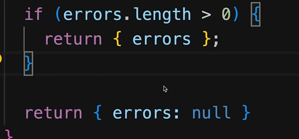

errors is an array type like const errors = []

This also a pattern in javascript where if no errors are there and you are returning errors enclosed or as an object then you can set value of the key errors as null.