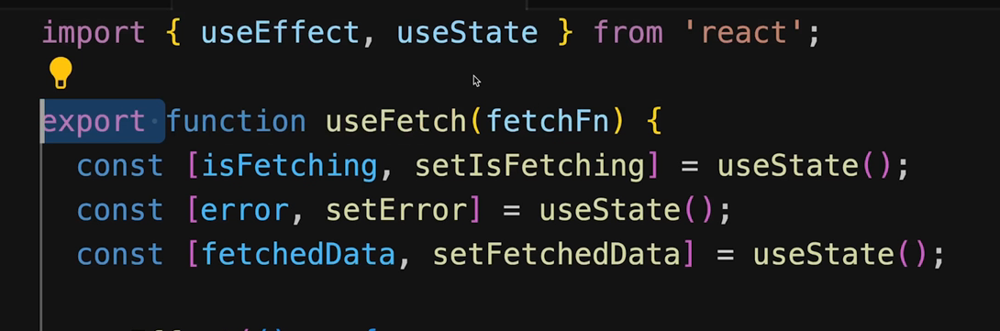
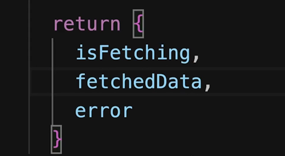
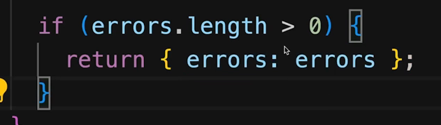
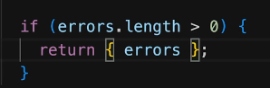
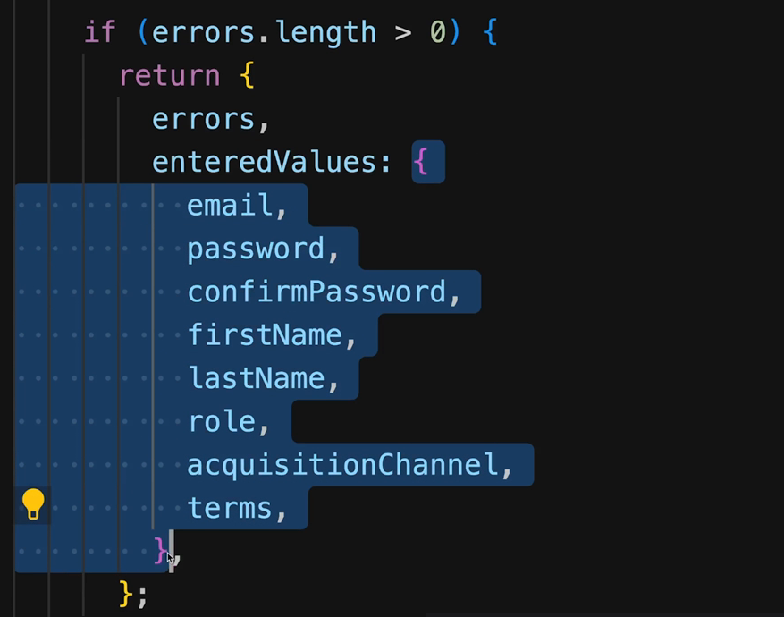

Above can be wrttein as below as key and value name are same. This is shorthand notation.

---

Another example where we are retrning object and object key and value name are same. Basically we are definign our own key name same as value name. Value name coming from states as these are state in the below picture.

---

Here both errors key and value are array with same name so you can simply use only key as below as a shorthand notation.

---

Same thing happening here as well.
