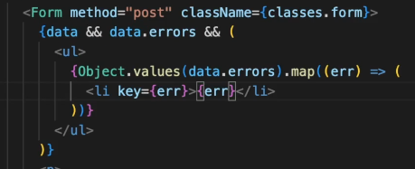

https://developer.mozilla.org/en-US/docs/Web/JavaScript/Reference/Global_Objects/Object/values



```
const object = {
  a: "some string",
  b: 42,
  c: false,
};

console.log(Object.values(object));
// Expected output: Array ["some string", 42, false]
```