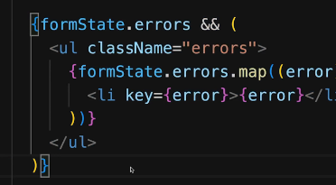

## Question: Can we use `formState.errors` directly as a truthy condition in JSX?

Yes. **`formState.errors` can be checked directly for truthiness** in JSX:

```jsx
{formState.errors && (
  <ul className="errors">
    {formState.errors.map((error) => (
      <li key={error}>{error}</li>
    ))}
  </ul>
)}
```

### 1. What does `{formState.errors}` mean?

The `{}` here are **JSX expression braces**.

They **do not mean that `formState.errors` is an object**.

For example:

```jsx
<div>{formState.errors}</div>
```

means:

> "Evaluate the JavaScript expression `formState.errors` and put its result into the JSX."

So `{}` simply allows us to write JavaScript inside JSX.

---

### 2. What is the shape of `formState`?

If your state is something like:

```javascript
const formState = {
  errors: null
};
```

then:

```javascript
formState.errors
```

is:

```text
null
```

Later it might become:

```javascript
const formState = {
  errors: ["Name is required", "Email is invalid"]
};
```

Then:

```javascript
formState.errors
```

is:

```text
["Name is required", "Email is invalid"]
```

So the shape is:

```text
formState
   |
   +-- errors
        |
        +-- null initially
        |
        +-- ["error1", "error2"] later
```

It is **not**:

```javascript
{ errors: null }
```

just because you wrote:

```jsx
{formState.errors}
```

The `{}` belong to **JSX syntax**, not to the data structure.

---

### 3. Can `formState.errors` be used as a truthy check?

**Yes. This is normal JavaScript behavior.**

```jsx
{formState.errors && (
  <ul>
    ...
  </ul>
)}
```

The `&&` operator works like this:

```javascript
condition && result
```

If `condition` is falsy:

```javascript
null && <ul>...</ul>
```

the result is:

```javascript
null
```

So React renders nothing.

If `condition` is truthy:

```javascript
["Name is required"] && <ul>...</ul>
```

the `<ul>` is evaluated/rendered.

So effectively:

```jsx
{formState.errors && (
  <ul>
    ...
  </ul>
)}
```

means:

> **"If `formState.errors` exists/is truthy, render the `<ul>`."**

---

### 4. One important JavaScript detail: an empty array is truthy

This is a common point to remember:

```javascript
Boolean(null)  // false
Boolean([])    // true
Boolean(["x"]) // true
```

Therefore:

```jsx
{formState.errors && (
  <ul>
    ...
  </ul>
)}
```

will render the `<ul>` even when:

```javascript
formState.errors = [];
```

But:

```jsx
formState.errors.map(...)
```

will simply produce nothing for an empty array.

So:

```javascript
errors = null
```

→ `<ul>` is not rendered.

```javascript
errors = []
```

→ `<ul>` is rendered, but it contains no `<li>`.

```javascript
errors = ["Invalid email"]
```

→ `<ul>` with one `<li>` is rendered.

---

### 5. The key distinction

| Syntax                    | Meaning                                      |
| ------------------------- | -------------------------------------------- |
| `{formState.errors}`      | **JSX expression container**                 |
| `formState.errors`        | Access the `errors` property                 |
| `{ errors: null }`        | **JavaScript object literal**                |
| `formState.errors && ...` | JavaScript **truthiness + short-circuiting** |

So your understanding should be:

> **The `{}` around `formState.errors` are JSX expression braces. They don't define the shape of `formState.errors`. And yes, because JSX allows JavaScript expressions, we can use `formState.errors` directly as a truthy condition.**

**Technology classification:** `{...}` as an expression container is **JSX-specific syntax**, while `&&`, truthiness, arrays, objects, and short-circuit evaluation are **JavaScript** concepts.
