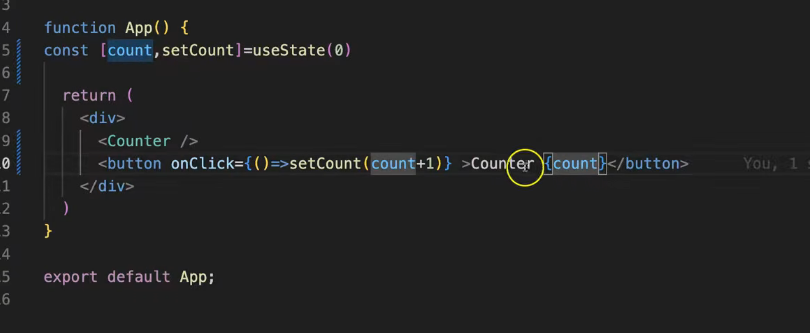

# Can you help me understand component refreshing and UI rendering logic in React using an animation? Do hooks like `useState` cause a component to refresh when a value needs to be rendered?**

### Short answer

**Yes, you are mostly correct.** But in React, we usually don't say the component **"refreshes"**. The correct term is:

> **The component re-renders.**

The important flow is:

```text
Event happens
     ↓
State changes using setState
     ↓
React schedules a re-render
     ↓
Component function runs again
     ↓
React compares old UI with new UI
     ↓
React updates only the necessary parts of the real DOM
```

---

# Think of it like an animation 🎬

Imagine this component:

```jsx
function Counter() {
  const [count, setCount] = useState(0);

  return (
    <>
      <p>{count}</p>
      <button onClick={() => setCount(count + 1)}>
        Increment
      </button>
    </>
  );
}
```

## Frame 1: Initial rendering

```text
React runs:

Counter()
    ↓
count = 0
    ↓
Returns UI:

[ 0 ]
[ Increment ]
```

Visually:

```text
┌──────────────────────┐
│                      │
│         0            │
│                      │
│   [ Increment ]      │
│                      │
└──────────────────────┘
```

At this point:

```js
count = 0
```

---

# Frame 2: User clicks the button

```text
👆 User clicks
       ↓
setCount(count + 1)
       ↓
setCount(1)
```

Here is the important part:

```js
setCount(1);
```

**does not directly change the UI itself.**

Instead, it tells React:

> "Hey React, my state has changed. Please render this component again."

---

# Frame 3: React re-renders the component

React conceptually runs:

```jsx
function Counter() {
  const [count, setCount] = useState(0);

  return (
    <>
      <p>{count}</p>
      <button>Increment</button>
    </>
  );
}
```

again.

But now React gives:

```js
count = 1
```

So the component now describes:

```text
┌──────────────────────┐
│                      │
│         1            │  ← New UI description
│                      │
│   [ Increment ]      │
│                      │
└──────────────────────┘
```

---

# Frame 4: Does React recreate the entire webpage? ❌

No.

This is the crucial part.

React compares:

```text
OLD UI                 NEW UI

[ 0 ]                  [ 1 ]
[ Button ]             [ Button ]
```

React figures out:

```text
Only this changed:

0 → 1
```

So React updates only the necessary part:

```text
Before:

<p>0</p>

        ↓

After:

<p>1</p>
```

The button doesn't need to be recreated just because the count changed.

---

# The complete animation 🎞️

```text
┌─────────────────────────────┐
│ 1. Component renders        │
│                             │
│ count = 0                   │
│                             │
│ UI: [ 0 ] [ Button ]        │
└──────────────┬──────────────┘
               │
               │ User clicks
               ▼
┌─────────────────────────────┐
│ 2. Event handler runs       │
│                             │
│ setCount(1)                 │
└──────────────┬──────────────┘
               │
               │ State update
               ▼
┌─────────────────────────────┐
│ 3. React schedules          │
│    re-render                │
└──────────────┬──────────────┘
               │
               ▼
┌─────────────────────────────┐
│ 4. Component function       │
│    runs again               │
│                             │
│ count = 1                   │
└──────────────┬──────────────┘
               │
               ▼
┌─────────────────────────────┐
│ 5. React compares UI        │
│                             │
│ Old: [ 0 ]                  │
│ New: [ 1 ]                  │
└──────────────┬──────────────┘
               │
               ▼
┌─────────────────────────────┐
│ 6. Real DOM updated         │
│                             │
│ 0 → 1                       │
└─────────────────────────────┘
```

---

# Your understanding, corrected

You said:

> `useState` does the component refresh when the value has to be rendered.

The more precise understanding is:

> <mark>**When we call the state setter returned by `useState`, such as `setCount()`, React <mark style="background-color: lightblue;">schedules</mark> the component for re-rendering. During the re-render, React executes the component function again and calculates what the UI should look like based on the new state. React then updates only the necessary parts of the actual DOM.**</mark>

---

## Very important: `useState` itself does NOT continuously refresh the component

This:

```jsx
const [count, setCount] = useState(0);
```

does not itself trigger continuous rendering.

The re-render happens when:

```jsx
setCount(newValue);
```

is called.

Think of it this way:

```text
useState()
   ↓
Creates/maintains state

setCount()
   ↓
Requests a state update

State changes
   ↓
React re-renders
```

---

# Simple mental model

Whenever you see a React component, think:

```text
Component Function
       +
Props
       +
State
       ↓
      UI
```

Mathematically:

```text
UI = f(State, Props)
```

For example:

```text
State = 0
   ↓
UI shows 0

State = 1
   ↓
Same component function runs again
   ↓
UI now shows 1
```

### My recommendation for learning React

Don't think:

> **"React changes the HTML."**

Think:

> **"When state changes, React runs the component again to calculate the new UI, then efficiently synchronizes the real DOM."**

That single mental model will make `useState`, props, parent-child rendering, `useEffect`, and later optimization concepts much easier to understand.

---



**Your question:** In `onClick`, sometimes we pass an arrow function, and sometimes we directly pass the function name. What is the difference?

Your question is clear. A more natural version would be:

> **In React, why do we sometimes use an arrow function in `onClick`, while other times we directly pass a function name? What is the difference?**

## Q: What are the two common ways to write an `onClick` handler?

### 1. Passing a function directly

```jsx
<button onClick={increment}>Increment</button>
```

### 2. Using an arrow function

```jsx
<button onClick={() => increment()}>Increment</button>
```

Both work, but there is an important difference in **how and when the function is called**.

---

## Q: What happens when we directly pass the function name?

```jsx
function increment() {
  setCount(count + 1);
}

<button onClick={increment}>Increment</button>
```

Here, you are giving the `increment` function to React.

You are essentially saying:

> **"React, when the user clicks the button, you call this function."**

So the function is **not executed immediately**.

### Important point

```jsx
onClick={increment}
```

means:

```text
Give the function to React
↓
User clicks the button
↓
React calls increment()
```

This is the simplest and preferred approach when you only need to call one existing function.

---

# Q: What happens when we use an arrow function?

```jsx
<button onClick={() => increment()}>Increment</button>
```

Here, you are giving React a **new arrow function**.

You are essentially saying:

> **"React, when the user clicks the button, first execute this arrow function. The arrow function will then call `increment()`."**

Flow:

```text
Give arrow function to React
↓
User clicks the button
↓
React calls the arrow function
↓
Arrow function calls increment()
```

So:

```jsx
onClick={() => increment()}
```

is an extra layer compared with:

```jsx
onClick={increment}
```

---

# Q: If both work, why do we need an arrow function?

Because sometimes you need to do **something before calling the function**, or you need to **pass your own argument**.

## Case 1: Passing an argument

Suppose:

```jsx
function incrementBy(number) {
  setCount(count + number);
}
```

You cannot write:

```jsx
<button onClick={incrementBy(1)}>Increment</button>
```

❌ This is wrong.

Why?

Because:

```jsx
incrementBy(1)
```

calls the function **immediately during rendering**.

Instead:

```jsx
<button onClick={() => incrementBy(1)}>
  Increment
</button>
```

Now the flow is:

```text
Component renders
↓
React stores the arrow function
↓
User clicks
↓
Arrow function runs
↓
incrementBy(1) runs
```

---

# Q: What is the biggest mistake beginners make?

This:

```jsx
<button onClick={increment()}>
  Increment
</button>
```

❌ Wrong.

Because the parentheses mean:

> **Call the function now.**

So this happens:

```text
Component renders
↓
increment() immediately executes
↓
setCount() changes state
↓
Component renders again
↓
increment() immediately executes again
```

This can cause repeated rendering problems.

---

# Q: So when should I use each one?

### Use the function name directly when:

```jsx
<button onClick={increment}>Increment</button>
```

Your handler only needs to execute that function.

This is the **cleanest and simplest approach**.

---

### Use an arrow function when you need:

#### 1. Arguments

```jsx
<button onClick={() => incrementBy(1)}>
  Increment
</button>
```

#### 2. Multiple operations

```jsx
<button onClick={() => {
  console.log("Button clicked");
  increment();
}}>
  Increment
</button>
```

#### 3. Extra logic

```jsx
<button onClick={() => {
  if (count < 10) {
    increment();
  }
}}>
  Increment
</button>
```

---

# Q: In your original example, why is the arrow function used?

Your example is:

```jsx
<button onClick={() => setCount(count + 1)}>
  Counter {count}
</button>
```

The arrow function is being used because the `setCount` call contains an expression:

```jsx
setCount(count + 1)
```

It needs to be executed **only when the button is clicked**.

If you wrote:

```jsx
<button onClick={setCount(count + 1)}>
```

then `setCount(count + 1)` would execute immediately while rendering.

So React needs this wrapper:

```jsx
() => setCount(count + 1)
```

---

# Q: Can we avoid the arrow function in your example?

Yes. Define a separate function:

```jsx
function App() {
  const [count, setCount] = useState(0);

  function increment() {
    setCount(count + 1);
  }

  return (
    <div>
      <Counter />

      <button onClick={increment}>
        Counter {count}
      </button>
    </div>
  );
}
```

This is perfectly valid and, for a reusable handler, often more readable.

---

# Q: What is the simplest rule to remember?

## Without parentheses = give the function

```jsx
onClick={increment}
```

Meaning:

> React will call it later.

---

## With parentheses = call the function now

```jsx
increment()
```

Meaning:

> Execute immediately.

---

## Arrow function = create a function that React will call later

```jsx
onClick={() => increment()}
```

Meaning:

> When clicked, execute this function, which will then call `increment()`.

---

## Final shortcut

```text
onClick={functionName}
        ↓
Use when no custom arguments or extra logic are needed.

onClick={() => functionName()}
        ↓
Use when you need to call it later with arguments or extra logic.

onClick={functionName()}
        ↓
Usually wrong for event handlers because it runs immediately.
```

### My recommendation

For simple React code, prefer:

```jsx
onClick={handleClick}
```

Use an arrow function only when it actually provides something extra:

```jsx
onClick={() => handleClick(id)}
```

That is the cleanest mental model.

---