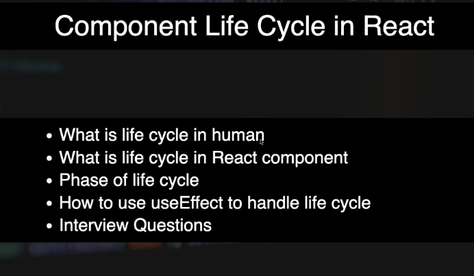

## Q1. Does that mean whatever we return from `useEffect` is called only once at the time of unmounting?

**Not exactly.** There is one important distinction:

### Only a returned **function** is treated as a cleanup function.

```jsx
useEffect(() => {
  return () => {
    console.log("Cleanup");
  };
}, []);
```

React does **not immediately execute** that arrow function. It stores it and calls it later.

### With `[]`

```jsx
useEffect(() => {
  return () => {
    console.log("Cleanup");
  };
}, []);
```

The cleanup usually runs when the component unmounts:

```text
Mount
  ↓
Effect runs
  ↓
Component stays
  ↓
Unmount
  ↓
Cleanup function runs
```

So in this specific case, **yes, it runs once during cleanup on unmount**.

---

## Q2. Is cleanup always called only on unmount?

**No.**

If dependencies change:

```jsx
useEffect(() => {
  console.log("Effect");

  return () => {
    console.log("Cleanup");
  };
}, [count]);
```

Then:

```text
count = 0
  ↓
Effect runs
  ↓
count changes to 1
  ↓
Previous cleanup runs
  ↓
New effect runs
  ↓
Later component unmounts
  ↓
Final cleanup runs
```

So the rule is:

> **The cleanup function runs before React runs the effect again, and also when the component unmounts.**

---

## Q3. What if I return a normal value?

For example:

```jsx
useEffect(() => {
  return 10;
}, []);
```

❌ This is not a valid cleanup.

React expects an effect to return:

* Nothing, or
* A cleanup function

The valid cleanup form is:

```jsx
return () => {
  // cleanup
};
```

So the important distinction is:

```text
return 10              ❌ Not cleanup
return "Hello"         ❌ Not cleanup
return {}              ❌ Not cleanup
return () => {}        ✅ Cleanup function
```

I have added this clarification to the lifecycle notes, including the exact timing for `[]`, `[dependency]`, and no dependency array.

**Download the regenerated complete Markdown file:**
[React_Component_Lifecycle_Notes.md](sandbox:/mnt/data/React_Component_Lifecycle_Notes.md)
