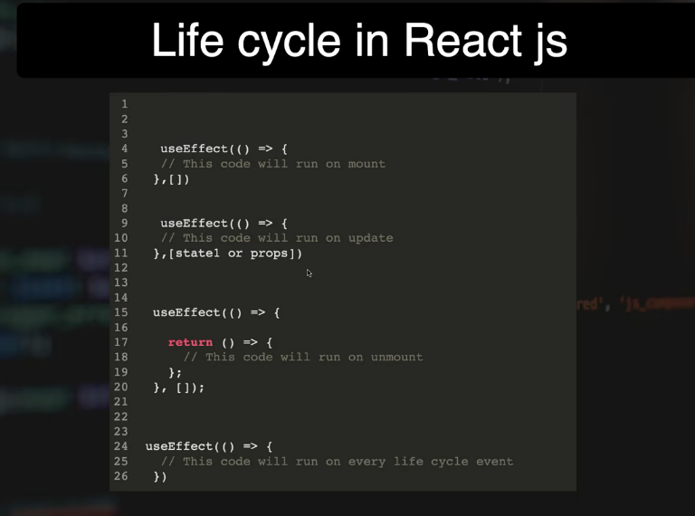

# Component Lifecycle in React

## Table of Contents

-   [1. What is a Lifecycle in Human
    Life?](#1-what-is-a-lifecycle-in-human-life)
-   [2. What is the Lifecycle of a React
    Component?](#2-what-is-the-lifecycle-of-a-react-component)
    -   [Mounting](#mounting)
    -   [Updating](#updating)
    -   [Unmounting](#unmounting)
-   [3. How to Use `useEffect` to Handle
    Lifecycle](#3-how-to-use-useeffect-to-handle-lifecycle)
-   [4. The Important Rule About `return` Inside
    `useEffect`](#4-the-important-rule-about-return-inside-useeffect)
    -   [Does any returned value run on
        unmount?](#does-any-returned-value-run-on-unmount)
    -   [Cleanup timing with `[]`](#cleanup-timing-with-)
    -   [Cleanup timing with
        dependencies](#cleanup-timing-with-dependencies)
    -   [Cleanup timing without
        dependencies](#cleanup-timing-without-dependencies)
-   [5. Cleanup in `useEffect`](#5-cleanup-in-useeffect)
-   [6. The Complete Lifecycle Flow](#6-the-complete-lifecycle-flow)
-   [7. Old Class Lifecycle vs Modern
    React](#7-old-class-lifecycle-vs-modern-react)
-   [8. Is `useEffect` Exactly a Lifecycle
    Method?](#8-is-useeffect-exactly-a-lifecycle-method)
-   [9. Common Interview Questions](#9-common-interview-questions)
-   [10. Final Cheat Sheet](#10-final-cheat-sheet)

------------------------------------------------------------------------



# 1. What is a Lifecycle in Human Life?

Think about a human:

``` text
Born
  ↓
Lives and changes
  ↓
Dies
```

A React component has a similar journey:

``` text
Created
  ↓
Appears on screen
  ↓
Changes when data changes
  ↓
Removed from screen
```

This journey is called the **component lifecycle**.

------------------------------------------------------------------------

# 2. What is the Lifecycle of a React Component?

A React component mainly goes through three phases:

## Mounting

The component is created and added to the screen.

``` text
Component does not exist
        ↓
React creates the component
        ↓
React shows it in the UI
```

Example:

``` jsx
function App() {
  return <h1>Hello</h1>;
}
```

When `App` first appears on the screen, it is **mounting**.

------------------------------------------------------------------------

## Updating

The component already exists, but something changes.

Common reasons:

-   State changes
-   Props change
-   Context changes

Example:

``` jsx
function Counter() {
  const [count, setCount] = useState(0);

  return (
    <>
      <p>{count}</p>

      <button onClick={() => setCount(count + 1)}>
        Increase
      </button>
    </>
  );
}
```

Simplified flow:

``` text
count = 0
   ↓
User clicks
   ↓
count = 1
   ↓
Component re-renders
   ↓
UI shows 1
```

This is the **updating phase**.

------------------------------------------------------------------------

## Unmounting

The component is removed from the screen.

Example:

``` jsx
function App() {
  const [show, setShow] = useState(true);

  return (
    <>
      <button onClick={() => setShow(false)}>
        Hide
      </button>

      {show && <Profile />}
    </>
  );
}
```

Initially:

``` text
show = true

<Profile />
```

After clicking **Hide**:

``` text
show = false

Profile is removed
```

The `Profile` component has now **unmounted**.

------------------------------------------------------------------------

# 3. How to Use `useEffect` to Handle Lifecycle

In modern React function components, `useEffect` is commonly used for
side effects.

Basic syntax:

``` jsx
useEffect(() => {
  // Run effect code

  return () => {
    // Cleanup code
  };
}, [dependencies]);
```

The dependency array controls **when the effect runs**.

## Run after initial mount

``` jsx
useEffect(() => {
  console.log("Component mounted");
}, []);
```

The empty dependency array means:

``` text
Initial mount
     ↓
Effect runs
```

Common use cases:

-   Initial API calls
-   Loading initial data
-   Setting up timers
-   Adding event listeners

------------------------------------------------------------------------

## Run when a value changes

``` jsx
useEffect(() => {
  console.log("Count changed");
}, [count]);
```

This runs:

``` text
After initial mount
        ↓
And whenever count changes
```

Example:

``` jsx
function Counter() {
  const [count, setCount] = useState(0);

  useEffect(() => {
    console.log("Count is:", count);
  }, [count]);

  return (
    <button onClick={() => setCount(count + 1)}>
      {count}
    </button>
  );
}
```

------------------------------------------------------------------------

## Run after every render

``` jsx
useEffect(() => {
  console.log("Runs after every render");
});
```

No dependency array means the effect can run after every render.

``` text
Mount
  ↓
Effect
  ↓
Update
  ↓
Effect
  ↓
Update
  ↓
Effect
```

Be careful: this can cause unnecessary work.

------------------------------------------------------------------------

# 4. The Important Rule About `return` Inside `useEffect`

Consider:

``` jsx
useEffect(() => {
  console.log("Effect starts");

  return () => {
    console.log("Cleanup");
  };
}, []);
```

The `return` here is special.

## Does any returned value run on unmount?

**No. This is the important correction.**

Inside `useEffect`, React expects the effect to return either:

1.  **Nothing**
2.  **A cleanup function**

### Valid

``` jsx
useEffect(() => {
  console.log("Effect");

  return () => {
    console.log("Cleanup");
  };
}, []);
```

### Also valid

``` jsx
useEffect(() => {
  console.log("Effect");
}, []);
```

### Not a cleanup

``` jsx
useEffect(() => {
  return 10;
}, []);
```

Returning a normal value like `10`, a string, or an object does **not**
mean React will use it during unmounting. React effects should return
either `undefined` or a function.

The key point is:

> **Only the function returned by `useEffect` is treated as the cleanup
> function.**

------------------------------------------------------------------------

## Cleanup timing with `[]`

Example:

``` jsx
useEffect(() => {
  console.log("Effect runs");

  return () => {
    console.log("Cleanup runs");
  };
}, []);
```

Because the dependency array is empty:

``` text
Component mounts
      ↓
Effect runs once
      ↓
Component stays on screen
      ↓
Component unmounts
      ↓
Cleanup runs once
```

So with:

``` jsx
useEffect(() => {
  return () => {
    // cleanup
  };
}, []);
```

the cleanup function normally runs when the component unmounts.

------------------------------------------------------------------------

## Cleanup timing with dependencies

Example:

``` jsx
useEffect(() => {
  console.log("Effect for count:", count);

  return () => {
    console.log("Cleaning previous count:", count);
  };
}, [count]);
```

Suppose:

``` text
count = 0
```

The effect runs.

Then:

``` text
count changes from 0 to 1
```

React performs the following sequence:

``` text
1. Component re-renders with count = 1
          ↓
2. Cleanup from the previous effect runs
          ↓
3. New effect runs with count = 1
```

Later, when the component unmounts:

``` text
Final cleanup runs
```

Therefore:

> With dependencies, cleanup runs both **before the effect runs again**
> and **when the component unmounts**.

------------------------------------------------------------------------

## Cleanup timing without dependencies

Example:

``` jsx
useEffect(() => {
  console.log("Effect");

  return () => {
    console.log("Cleanup");
  };
});
```

Since there is no dependency array:

``` text
Render 1
   ↓
Effect 1
   ↓
Render 2
   ↓
Cleanup 1
   ↓
Effect 2
   ↓
Render 3
   ↓
Cleanup 2
   ↓
Effect 3
   ↓
Unmount
   ↓
Final cleanup
```

So the cleanup does **not** always run only once.

It depends on the dependency array.

------------------------------------------------------------------------

# 5. Cleanup in `useEffect`

A cleanup function is useful when an effect creates something that
should later be stopped or removed.

Example:

``` jsx
useEffect(() => {
  const timer = setInterval(() => {
    console.log("Running");
  }, 1000);

  return () => {
    clearInterval(timer);
  };
}, []);
```

Flow:

``` text
Component mounts
      ↓
Timer starts
      ↓
Timer keeps running
      ↓
Component unmounts
      ↓
Cleanup runs
      ↓
Timer stops
```

Cleanup is commonly used for:

-   Clearing timers
-   Removing event listeners
-   Closing WebSocket connections
-   Cancelling subscriptions
-   Cleaning up external resources

------------------------------------------------------------------------

# 6. The Complete Lifecycle Flow

The complete modern React mental model is:

``` text
MOUNT
  ↓
Component renders
  ↓
React commits UI
  ↓
Effect runs
  ↓
State/props change
  ↓
Component re-renders
  ↓
Previous cleanup runs if the effect must re-run
  ↓
New effect runs
  ↓
Component unmounts
  ↓
Final cleanup runs
```

For an effect with dependencies:

``` jsx
useEffect(() => {
  // Effect

  return () => {
    // Cleanup
  };
}, [dependency]);
```

Think:

``` text
Effect
  ↓
Dependency changes
  ↓
Previous cleanup
  ↓
New effect
  ↓
Component unmounts
  ↓
Final cleanup
```

------------------------------------------------------------------------

# 7. Old Class Lifecycle vs Modern React

Before Hooks, React commonly used class components.

``` jsx
class App extends React.Component {
}
```

Common lifecycle methods:

## Mounting

``` jsx
constructor()
componentDidMount()
```

## Updating

``` jsx
componentDidUpdate()
```

## Unmounting

``` jsx
componentWillUnmount()
```

Example:

``` jsx
class App extends React.Component {
  componentDidMount() {
    console.log("Mounted");
  }

  componentDidUpdate() {
    console.log("Updated");
  }

  componentWillUnmount() {
    console.log("Unmounted");
  }

  render() {
    return <h1>Hello</h1>;
  }
}
```

Modern React generally prefers function components and Hooks:

``` jsx
function App() {
}
```

Common Hooks:

``` jsx
useState()
useEffect()
useContext()
```

------------------------------------------------------------------------

## Mapping old lifecycle methods to modern React

  Old class approach       Modern approach
  ------------------------ --------------------------------------------
  `componentDidMount`      Effect with appropriate dependencies
  `componentDidUpdate`     Effect that reacts to changed dependencies
  `componentWillUnmount`   Cleanup function returned from an effect

A rough conceptual mapping:

``` jsx
useEffect(() => {
  // setup

  return () => {
    // cleanup
  };
}, []);
```

But modern React does not recommend thinking that every `useEffect` is
simply a lifecycle replacement.

------------------------------------------------------------------------

# 8. Is `useEffect` Exactly a Lifecycle Method?

**No.**

The better modern mental model is:

> **`useEffect` synchronizes your React component with something outside
> React.**

Examples of external systems:

-   Browser APIs
-   Timers
-   API subscriptions
-   WebSocket connections
-   Event listeners
-   Third-party libraries

Example:

``` jsx
useEffect(() => {
  document.title = `Count: ${count}`;
}, [count]);
```

React state changes:

``` text
count changes
    ↓
Effect runs
    ↓
Browser title is synchronized
```

So:

``` text
React state/UI
      ↓
useEffect
      ↓
External system
```

------------------------------------------------------------------------

# 9. Common Interview Questions

## What are the main lifecycle phases?

**Answer:**

``` text
Mounting
Updating
Unmounting
```

------------------------------------------------------------------------

## When does `useEffect(() => {}, [])` run?

It runs after the component is initially mounted.

The cleanup function returned from that effect runs when the component
unmounts.

------------------------------------------------------------------------

## When does this run?

``` jsx
useEffect(() => {
}, [count]);
```

**Answer:**

-   After the initial mount
-   When `count` changes

------------------------------------------------------------------------

## When does the cleanup run?

For:

``` jsx
useEffect(() => {
  return () => {
    // cleanup
  };
}, []);
```

Cleanup runs when the component unmounts.

For:

``` jsx
useEffect(() => {
  return () => {
    // cleanup
  };
}, [count]);
```

Cleanup runs:

1.  Before the effect re-runs because `count` changed
2.  When the component unmounts

------------------------------------------------------------------------

## Does every `return` value from `useEffect` become cleanup?

**No.**

Only a returned **function** is treated as cleanup.

``` jsx
return () => {
  // cleanup
};
```

This function is not executed immediately by JavaScript. React stores it
and calls it later at the appropriate cleanup time.

------------------------------------------------------------------------

# 10. Final Cheat Sheet

``` text
Component Lifecycle

Mount
  ↓
Component appears
  ↓
Effect runs
  ↓
Update
  ↓
Previous cleanup may run
  ↓
New effect runs
  ↓
Unmount
  ↓
Final cleanup runs
```

## `useEffect` patterns

``` jsx
useEffect(() => {
});
```

Effect can run after every render.

``` jsx
useEffect(() => {
}, []);
```

Effect runs after initial mount.

``` jsx
useEffect(() => {
}, [count]);
```

Effect runs after initial mount and when `count` changes.

``` jsx
useEffect(() => {
  return () => {
    // cleanup
  };
}, []);
```

Cleanup runs on unmount.

``` jsx
useEffect(() => {
  return () => {
    // cleanup
  };
}, [count]);
```

Cleanup runs before the effect re-runs because `count` changed, and
again on unmount.

------------------------------------------------------------------------

## Best Mental Model

> **Rendering decides what the UI should look like.**
>
> **Effects synchronize React with the outside world.**
>
> **The function returned by an effect cleans up that synchronization.**
