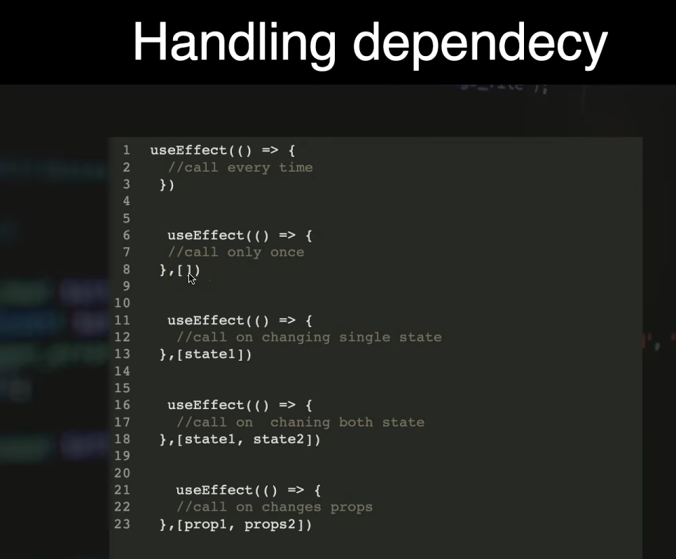

### Handling Dependency in useEffect.



# Summary of All the constructors (Also given in below, just copied just for summary)

| Code                                 | When does it run?              |
| ------------------------------------ | ------------------------------ |
| `useEffect(() => {})`                | After every render             |
| `useEffect(() => {}, [])`            | After initial render           |
| `useEffect(() => {}, [count])`       | When `count` changes           |
| `useEffect(() => {}, [count, name])` | When `count` or `name` changes |

---

## Q: Can you explain `useEffect` dependencies in simple terms?

**You're right on the spot.** The image is explaining the most important part of `useEffect`: **the dependency array**.

The simplest way to think about it is:

> **The dependency array tells React: “When should I run this effect again?”**

```js
useEffect(() => {
  // Side effect code
}, [dependencies]);
```

---

# 1. No dependency array → Run after every render

```js
useEffect(() => {
  console.log("Effect runs");
});
```

## Meaning

React runs the effect after **every render**.

### Example

```jsx
function App() {
  const [count, setCount] = useState(0);

  useEffect(() => {
    console.log("Effect runs");
  });

  return (
    <button onClick={() => setCount(count + 1)}>
      {count}
    </button>
  );
}
```

### What happens?

1. Component renders → effect runs.
2. Click button → `count` changes.
3. Component re-renders → effect runs again.
4. Click again → component re-renders → effect runs again.

So:

```text
No dependency array
        ↓
Run after every render
```

⚠️ Usually, this is **not what you want** because effects may run unnecessarily.

---

# 2. Empty dependency array `[]` → Run once after initial render

```js
useEffect(() => {
  console.log("Effect runs once");
}, []);
```

## Meaning

```text
Component appears first time
        ↓
Component renders
        ↓
Effect runs
        ↓
Future state changes
        ↓
Effect does NOT run again
```

### Example

```jsx
function App() {
  const [count, setCount] = useState(0);

  useEffect(() => {
    console.log("Fetch initial data");
  }, []);

  return (
    <button onClick={() => setCount(count + 1)}>
      {count}
    </button>
  );
}
```

The `useEffect` runs after the **initial render**.

Even when `count` changes, the effect does not run again.

### Common use cases

* Initial data loading
* Setting up subscriptions
* Adding event listeners
* One-time initialization

---

# 3. One dependency `[count]` → Run when `count` changes

```js
useEffect(() => {
  console.log("Count changed");
}, [count]);
```

## Meaning

React watches `count`.

```text
Did count change?
      ↓
    YES → Run effect
      ↓
     NO → Don't run effect
```

### Example

```jsx
function App() {
  const [count, setCount] = useState(0);

  useEffect(() => {
    console.log("New count:", count);
  }, [count]);

  return (
    <button onClick={() => setCount(count + 1)}>
      {count}
    </button>
  );
}
```

If `count` changes:

```text
0 → 1 → effect runs
1 → 2 → effect runs
2 → 3 → effect runs
```

---

# 4. Multiple dependencies `[count, name]`

```js
useEffect(() => {
  console.log("Count or name changed");
}, [count, name]);
```

## Meaning

React watches **both values**.

```text
count changes → Run effect

name changes  → Run effect

nothing changes → Don't run effect
```

### Example

```jsx
useEffect(() => {
  console.log("Something changed");
}, [count, name]);
```

Think of it as:

> Run this effect whenever **any dependency in this list changes**.

---

# The most important dependency rule

Look at this:

```js
useEffect(() => {
  console.log(count);
}, [count]);
```

The effect **uses `count`**, so `count` should normally be listed as a dependency.

React needs to know:

> “If this value changes, should I run this effect again?”

Yes → put it in the dependency array.

---

# Your image in one simple table

| Code                                 | When does it run?              |
| ------------------------------------ | ------------------------------ |
| `useEffect(() => {})`                | After every render             |
| `useEffect(() => {}, [])`            | After initial render           |
| `useEffect(() => {}, [count])`       | When `count` changes           |
| `useEffect(() => {}, [count, name])` | When `count` or `name` changes |

---

# One important correction to the image

The image says:

```js
useEffect(() => {
  // call on changing props
}, [prop1, props2]);
```

A more accurate explanation is:

> The effect runs when **any value in the dependency array changes**.

These dependencies can be:

* State
* Props
* Variables derived during rendering
* Functions or objects, with some important caveats

For example:

```js
useEffect(() => {
  console.log(userId);
}, [userId]);
```

It doesn't matter whether `userId` came from:

```js
const [userId, setUserId] = useState();
```

or:

```js
function App({ userId }) {
```

React simply checks whether the dependency value has changed.

---

# One simple mental model 🧠

Think of `useEffect` as a **watcher**:

```js
useEffect(() => {
  // Do something
}, [A, B]);
```

React asks:

```text
Did A change?
OR
Did B change?
```

If yes:

```text
Run the effect.
```

---

## The biggest practical point

Do **not** think:

> "`useEffect` runs when the dependency changes."

More accurately:

> **A dependency change causes a re-render, and after React updates the UI, React compares the dependencies and then runs the effect if a dependency changed.**

That distinction becomes very important when understanding React rendering.

If you want, I can next explain this using your preferred **React UI frame-by-frame animation style**:

**Render → UI update → dependency comparison → `useEffect` execution**.
