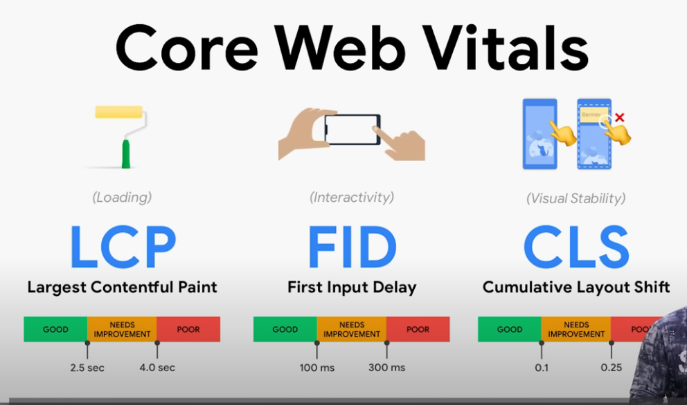

# Core Web Vitals

This image explains "Core Web Vitals," which are a set of specific metrics that Google uses to measure the user experience of a web page. They are crucial for website owners and developers because they can impact search engine rankings and, more importantly, user satisfaction.

The image breaks down Core Web Vitals into three main metrics, each with its own focus and corresponding good, needs improvement, and poor thresholds:

1.  **LCP (Largest Contentful Paint)**
    * **Category:** (Loading)
    * **Explanation:** LCP measures the time it takes for the largest content element on the page (like a large image or block of text) to become visible within the user's viewport. It essentially tells you how quickly the main content of your page loads and becomes useful to the user.
    * **Thresholds:**
        * **GOOD:** Less than or equal to 2.5 seconds
        * **NEEDS IMPROVEMENT:** Between 2.5 seconds and 4.0 seconds
        * **POOR:** Greater than 4.0 seconds
    * **Analogy (from image):** Represented by a paint roller, symbolizing the rendering of content.

2.  **FID (First Input Delay)**
    * **Category:** (Interactivity)
    * **Explanation:** FID measures the time from when a user first interacts with a page (e.g., clicks a button, taps a link) to the time when the browser is actually able to respond to that interaction. It assesses the responsiveness of your page to user input. A high FID means the page feels sluggish.
    * **Thresholds:**
        * **GOOD:** Less than or equal to 100 milliseconds (ms)
        * **NEEDS IMPROVEMENT:** Between 100 ms and 300 ms
        * **POOR:** Greater than 300 ms
    * **Analogy (from image):** Represented by a hand interacting with a smartphone screen, symbolizing user input.

3.  **CLS (Cumulative Layout Shift)**
    * **Category:** (Visual Stability)
    * **Explanation:** CLS measures the sum total of all unexpected layout shifts that occur during the entire lifespan of a page. An unexpected layout shift happens when visible elements on the page move around without user initiation (e.g., an image loading late and pushing text down, or an ad slot suddenly appearing). High CLS can be very frustrating for users, leading to misclicks or difficulty reading.
    * **Thresholds:**
        * **GOOD:** Less than or equal to 0.1
        * **NEEDS IMPROVEMENT:** Between 0.1 and 0.25
        * **POOR:** Greater than 0.25
    * **Analogy (from image):** Represented by a smartphone screen with elements shifting, specifically a "Banner" appearing and pushing down content, indicating an unstable layout.

In summary, Core Web Vitals are about measuring how users perceive the performance of your website in terms of **loading speed, interactivity, and visual stability**. Meeting the "GOOD" thresholds for all three metrics is crucial for providing an excellent user experience and is favored by search engines like Google.